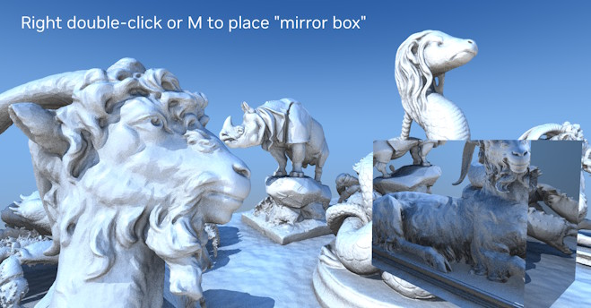
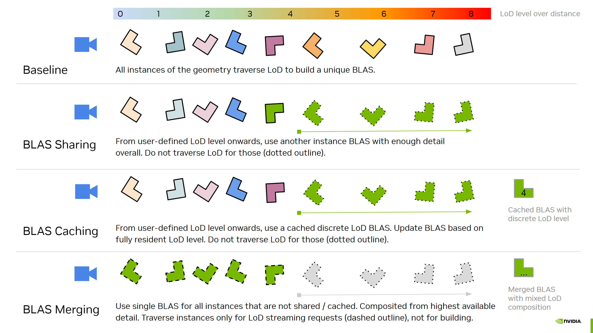

# vk_lod_clusters

This sample is demonstrating the **NVIDIA RTX Mega Geometry** technology with a continuous level of detail (LoD) technique using mesh clusters that 
leverages [`VK_NV_cluster_acceleration_structure`](https://registry.khronos.org/vulkan/specs/latest/man/html/VK_NV_cluster_acceleration_structure.html) for ray tracing. It can also rasterize the content 
using `VK_EXT/NV_mesh_shader`. Furthermore, the sample implements an on-demand streaming system from RAM to VRAM for the geometry.

In rasterization continuous LoD techniques can help performance as they reduce the impact of sub-pixel triangles.
For both ray tracing and rasterization these techniques can be combined with streaming the geometry data at
the required detail level and work within a memory budget.

This work was inspired by the Nanite rendering system for [Unreal Engine](https://www.unrealengine.com/) by Epic Games.
We highly recommend having a look at [A Deep Dive into Nanite Virtualized Geometry, Karis et al. 2021](https://www.advances.realtimerendering.com/s2021/Karis_Nanite_SIGGRAPH_Advances_2021_final.pdf).

Please have a look at the [vk_animated_clusters](https://github.com/nvpro-samples/vk_animated_clusters) to familiarize yourself with the new ray tracing cluster extension.
There are some similarities in the organization of this sample with the [vk_tessellated_clusters](https://github.com/nvpro-samples/vk_tessellated_clusters) sample.

The sample makes use of the [meshoptimizer](https://github.com/zeux/meshoptimizer) library to process
the model and generate the required cluster and LoD data. The LoD system is organized in groups of clusters whose meshes were simplified together.

## Continuous level of detail using clusters

For some basic description what data structures the continous LoD system uses and how it works please look [here](docs/lod_generation.md).

In principle the rendering loop is similar for rasterization and ray tracing.
The traversal of the LoD hierarchy and the interaction with the streaming system are the same.

One key difference is that for ray tracing the cluster level acceleration structures (CLAS) need to be built,
as well as the bottom level acceleration structure (BLAS) that reflects which clusters are used in an instance.
Rasterization can render directly from the original geometry data and can render from the global list of clusters
of any instance.

To allow easing into the topic, the sample has options to disable streaming as well as simplifying the CLAS
allocation or switch between rasterization and ray tracing. In the next sections we will go over how the sample 
is organized and the key operations, what functions and files to look at.

Data structures that are shared between host and device are within the `shaderio` namespace:
* [shaders/shaderio.h](/shaders/shaderio.h): Frame setup like camera and readback structure for debugging, some statistics.
* [shaders/shaderio_scene.h](/shaders/shaderio_scene.h): Key definitions to represent the scene and cluster geometry.

The scene can be rendered with or without streaming:
* [scene_preloaded.cpp](/src/scene_preloaded.cpp): simply uploads all geometry, with all clusters of all LoD levels.
* [scene_streaming.cpp](/src/scene_streaming.cpp): implements the streaming system, more details later. Enabled by default.

The full logic of the renderers is implemented in:
* [renderer_raster_clusters_lod.cpp](/src/renderer_raster_clusters_lod.cpp): Rasterization using `VK_NV_mesh_shader` or `VK_EXT_mesh_shader`
* [renderer_raytrace_clusters_lod.cpp](/src/renderer_raytrace_clusters_lod.cpp): Ray tracing using `VK_NV_cluster_acceleration_structure`. Enabled by default if available.

The sample also showcases a ray tracing specific optimization for [BLAS Sharing](docs/blas_sharing.md).

### Model processing

This sample uses a custom fork of [meshoptimizer's](https://github.com/zeux/meshoptimizer) single header [clusterlod.h](src/meshopt_clusterlod.h) to support "inner" parallelism.

Inside [scene_cluster_lod.cpp](/src/scene_cluster_lod.cpp) the `Scene:buildGeometryLod(...)` function covers the usage of the libraries and what data we need to extract from them. The `Scene::storeGroup(...)` function takes the resulting cluster group and packs it into a binary blob used for the runtime representation. The geometry data is later saved into the cache file for faster loading and streaming.

The cluster group can be compressed using a lossless compression scheme. However, we recommend the dropping of mantissa bits for both vertex positions and UV coordinates.
The compression is done in the `Scene::compressGroup(...)` function inside [scene_cluster_compression.cpp](/src/scene_cluster_compression.cpp).

In the UI you can influence the size of clusters and the LoD grouping of them in _"Clusters & LoDs generation"_.

> [!WARNING]
> The processing of larger scenes can take a while, even on CPUs with many cores. Therefore the application will save
> an uncompressed cache file of the results automatically. This file is a simple memory mappable binary file that can take a lot of space
> and is placed next to the original file with a `.nvsngeo` file ending. During processing existing cache files will be overwritten without warning.
> If disk space is a concern use `--autosavecache 0` to avoid the automatic storage, however it is not recommended.
>
> With the `--processingonly 1` command-line option one can reduce peak memory consumption during processing of scenes with many geometries.
> In this mode saving to the cache file is interleaved with the processing and resources are deallocated immediately once saved.
> At the end of the processing the app closes automatically.
> In combination with the `--processingpartial 1` command-line option, the processing only mode can resume partial results. So one can terminate the app during processing and continue at a later time.
> There is no consistency checking of settings or input meshes for this.
> To reduce system memory usage during processing one may lower the percentage of system threads that are used via `--processingthreadpct <float 0.0 - 1.0>` (default is 0.5, half the systems supported concurrency).
>
> If system memory usage after loading a cached file is a concern, then `--mappedcache 1` can be used to load data through memory mapping directly (forced for caches that are >= 2 GiB). However, we still have to improve the streaming logic a bit to avoid IO related hitches.
>
> Be aware, there are currently only few compatibility checks for these cache files, therefore we recommend deleting if changes were made to the original input mesh.

### Runtime Rendering Operations

The key operation for rendering is to traverse the LoD hierarchy and build the list of
renderable clusters. For ray tracing we need to build BLAS based on that list as well.
When streaming is active, then CLAS have to be built for the clusters of the newly loaded groups (dashed outlines).
They are built into scratch space first, so the allocation logic can use their accurate build sizes
and move them to a persistent location.

All operations are performed indirectly on the device and do not require any readbacks to host.

Use _"Traversal"_ settings within the UI to influence it.

Relevant files to traversal in their usage order:
* [shaders/shaderio_building.h](/shaders/shaderio_building.h): All data structures related to traversal are stored in `SceneBuilding`
* [shaders/traversal_init.comp.glsl](/shaders/traversal_init.comp.glsl): Seeds the LoD root nodes of instances for traversal into `SceneBuilding::traversalNodeInfos`. Implements a shortcut to directly insert the low detail cluster into `SceneBuilding::renderClusterInfos` if only the furthest LoD would be traversed (also skips BLAS building for ray tracing).
* [shaders/traversal_run.comp.glsl](/shaders/traversal_run.comp.glsl): Performs the hierarchical LoD traversal using a persistent kernel. Outputs the list of render clusters `SceneBuilding::renderClusterInfos`.
* [shaders/build_setup.comp.glsl](/shaders/build_setup.comp.glsl): Simple compute shader that is used to do basic operations in preparation of other kernels. Often clamping results to stay within limits.
* [shaders/blas_setup_insertion.comp.glsl](/shaders/blas_setup_insertion.comp.glsl): Sets up the per-BLAS range for the cluster references based on how many clusters each BLAS needs (which traversal computed as well). This also determines how many BLAS are built at all.
* [shaders/blas_clusters_insert.comp.glsl](/shaders/blas_clusters_insert.comp.glsl): Fills the per-BLAS cluster references (`SceneBuilding::blasBuildInfos`) from the render cluster list. The actual BLAS build is triggered in `RendererRayTraceClustersLod::render` (look for "BLAS Build").
* [shaders/instances_assign_blas.comp.glsl](/shaders/instances_assign_blas.comp.glsl): After BLAS building assigns the built BLAS addresses to the TLAS instance descriptors prior building the TLAS.

**Rasterization:**
Does not need the BLAS and TLAS build steps and can render directly from `SceneBuilding::renderClusterInfos`.
Frustum and occlusion culling can be done to reduce the number of rendered clusters during traversal.
* [shaders/render_raster_clusters.mesh.glsl](/shaders/render_raster_clusters.mesh.glsl): Mesh shader to render a cluster.
* [shaders/render_raster.frag.glsl](/shaders/render_raster.frag.glsl)

**Ray Tracing:**
After the BLAS are built, also runs the TLAS build or update and then traces rays.
Frustum and occlusion culling only influence the LoD factors per-instance through a simple heuristic. Ray tracing will render more clusters even with culling than raster.

Use the "Mirror Box" effect (double right-click or M key) to investigate the impact on geometry that is outside the frustum or
otherwise occluded.

* [shaders/render_raytrace_clusters.rchit.glsl](/shaders/render_raytrace_clusters.rchit.glsl): Hit shader that handles shading of a hit on a cluster. There is only cluster geometry in this sample to be hit.
* [shaders/render_raytrace.rgen.glsl](/shaders/render_raytrace.rgen.glsl)
* [shaders/render_raytrace.rmiss.glsl](/shaders/render_raytrace.rmiss.glsl)

The ray tracing code path can optimize the number of BLAS builds through _"BLAS Sharing"_, which allows instances to use the BLAS
from another instance.

Please have a look at the [BLAS Sharing documentation](docs/blas_sharing.md).

The occlusion culling is kept basic, testing the footprint of the bounding box against the appropriate mip-level of last frame's HiZ buffer and last frame's matrices. This can cause artifacts on faster motion.

### Streaming Operations

Please have a look at the [Streaming Operations documentation](docs/streaming.md)

### GPU-Driven CLAS Allocation

Please have a look at the [GPU-Driven CLAS Allocation documentation](docs/clas_allocation.md)

## Problem-Solving

The sample uses a lot of technologies and has many configurations. We don't have a lot of test coverage for it. If you experience instabilities, please let us know through GitHub Issues.
You can use the commandline to change some defaults:

* `--renderer 0` starts with rasterization.
* `--supersample 0` disables the super sampling that otherwise doubles rendering resolution in each dimension. 
* `--clasallocator 0` disables the more complex gpu-driven allocator when streaming
* `--gridcopies N` set the number of model copies in the scene.
* `--gridunique 0` disables the generation of unique geometries for every model copy. Greatly reduces memory consumption by truly instancing everything. It's on for the sample bunny scene by default, but off otherwise.
* `--streaming 0` disables streaming system and uses preloaded scene (warning this can use a lot of memory, use above `--gridunique 0` to reduce)
* `--vsync 0` disable vsync. If changing vsync via UI does not work, try to use the driver's *NVIDIA Control Panel* and set `Vulkan/OpenGL present method: native`.
* `--autoloadcache 0` disables loading scenes from cache file.
* `--mappedcache 1` keeps memory mapped cache file persistently, otherwise loads cache to system memory. Useful to save RAM on very large scenes.
* `--autosavecache 0` disables saving the cache file.
* `--processingonly 1 --processingthreadpct 0.25 --processingpartial 1` when processing big scenes, the dedicated processing only mode is better and one can reduce the memory consumption by lowering the amount of threads used.
* `--forcepreprocessmegabytes 1024` if a scene's raw geometry (vertex & indices) is greater than this cutoff, use a dedicated preprocess pass. Can be quicker and allows using memory mapped cache file. Default is 2048 for 2 GiB.

## Limitations

* The `ClusterID` can only be accessed in shaders using  `gl_ClusterIDNV` after enabling `VkRayTracingPipelineClusterAccelerationStructureCreateInfoNV::allowClusterAccelerationStructure` for that pipeline.
  We use `GL_EXT_spirv_intrinsics` rather than dedicated GLSL extension support that may come at a later time.
* Few error checks are performed on out of memory situations, which can happen on higher _"render copies"_ values, or the complexity of the loaded scene
* The number of threads used in the persistent kernel is based on a crude heuristic for now and was not evaluated to be the optimal amount.
* The bounding box visualizations don't show for ray tracing when DLSS is active, and they will only show clusters that are part of BLAS builds in the current frame. Prefer using rasterization to see them.

## Future Improvements

Next:
* For streaming transfer compressed cluster groups and uncompress them in a compute shader after upload.
Other:
* Add more material features and basic texturing.
* Add texture streaming.
* Fallback for persistent traversal kernel.
* Allowing the use of a compute shader to do rasterization of smaller/non-clipped triangles.
* Implement sorting of streaming requests based on distance of instance. Sorting instances alone is not sufficient.

## Building and Running

Requires at least Vulkan SDK 1.4.309.0

The new `VK_NV_cluster_acceleration_structure` extension requires new drivers, earliest release version is `572.16` from 1/30/2025.
The sample should run on older drivers with just rasterization available.

Point cmake to the `vk_lod_clusters` directory and for example set the output directory to `/build`.
We recommend starting with a `Release` build, as the `Debug` build has a lot more UI elements.

The cmake setup will download the `Stanford Bunny` glTF 2.0 model that serves as default scene.

If `USE_DLSS` is activated in the cmake options, then the DLSS/NGX runtime is downloaded by cmake setup as well and DLSS denoising is available for the ray tracer.

It will also look for [`nvpro_core2`](https://github.com/nvpro-samples/nvpro_core2) either as subdirectory of the current project directory, or up to two levels above. If it is not found, it will automatically download the git repo into .

> [!IMPORTANT]
> Note, that the repository of `nvpro_core2` needs to be updated manually, when the sample is updated manually, as version mismatches could occur over time. Either run the appropriate git commands or delete `/build/_deps/nvpro_core2`.

### Interactions

* `WASD` and `QE` to control the camera. `SHIFT` for faster speed, `CTRL` for slower. `ALT` to orbit around the last hit point.
* `SPACE` or `double left click` to get a surface hit point that the camera will orient itself to. This also adjusts the walking speed based on a percentage of the distance to the point. Meaning close by hit points will cause slower walk than points further in the distance.
* `M` or `double right click` to on a surface hit point to generate the reflective mirror box in ray tracing. Trigger this on the sky to make it disappear.
* `R` to reload the shaders (meant for debugging).

## Further Samples about NVIDIA RTX Mega Geometry

Other Vulkan samples using the new extensions are:
- https://github.com/nvpro-samples/vk_animated_clusters - showcases basic usage of new ray tracing cluster extension.
- https://github.com/nvpro-samples/vk_lod_clusters - provides a sample implementation of a basic cluster-LoD based rendering and streaming system.
- https://github.com/nvpro-samples/vk_partitioned_tlas - New extension to manage incremental TLAS updates.

We also recommend having a look at [RTX Mega Geometry](https://github.com/NVIDIA-RTX/RTXMG), which demonstrates tessellation of subdivision surfaces in DirectX 12.

## Additional Scenes

### Zorah Demo Scene

This is a glTF export of the highly detailed raw geometry from the [NVIDIA RTX Kit - Zorah Sample](https://developer.nvidia.com/rtx-kit?sortBy=developer_learning_library) as [presented at GDC 2025](https://developer.nvidia.com/blog/nvidia-rtx-advances-with-neural-rendering-and-digital-human-technologies-at-gdc-2025/).

- [zorah_main_public.gltf.7z](http://developer.download.nvidia.com/ProGraphics/nvpro-samples/zorah_main_public.gltf.7z)
  - 1.64 G Triangles, with instancing 18.9 G Triangles
  - Cannot be pre-loaded must be streamed
  - **12.8 GB 7z** - 2025/9/9, unpacks to **36.1 GB on disk**
  - The render cache file will require 62 GB next to the gltf file, it can be downloaded (see next link)
- [zorah_main_public.gltf.nvsngeo.7z](https://developer.download.nvidia.com/ProGraphics/nvpro-samples/zorah_main_public.gltf.nvsngeo.7z)
  - **19.5 GB 7z** - 2025/11/10, unpacks to **26.0 GB on disk**
  - Ensure that the `zorah_main_public.gltf.nvsngeo` is in the same directory as `zorah_main_public.gltf`.
  - If you want to avoid this big download and do the pre-processing for the cluster lod manually, use the following command-line:
    - `vk_lod_cluster.exe "zorah_main_public.gltf" --clusterconfig 4 --processingonly 1 --processingthreadpct 0.5 --processingpartial 1 --compressed 1`
    - This will use 50% of the local PC's supported concurrency to process the model and allow to abort and resume the processing. On a 16-core Ryzen 9 a value of `0.5` will yield 16 threads, requires 29 GB RAM (brief peak of 44 GB) and takes around 6 minutes. We recommend lower thread percentages on machines with less RAM.
  - **NOTE:** Older versions of this file were larger, this sample has changed the file format of its file cache. When loading an old version, the processing will be triggered automatically and the old cache file is overwritten. It can take a bit until the new file versions have been propagated to servers worldwide.

Make sure to use an NVME or SSD drive for storing these files. We recommend GPUs with at least 8 GB VRAM.

> [!IMPORTANT]
> Open or Drag & Drop the `zorah_main_public.cfg` file within the vk_lod_clusters application and _NOT_ the glTF directly.
> Make sure the processed `zorah_main_public.gltf.nvsngeo` was either downloaded or generated as described above.

Known Issues:
* Compared to the original demo the vegetation had to be removed to make the sharing of the glTF possible (the asset itself is licensed under MIT License).
* Some objects float a bit strangely in the air and lack animation, this is expected for this scene and sample.
* The vegetation will appear to fade out a bit quickly, especially the grass. This is a known limitation for mesh-based simplifcation on
  sparse geometry like this. We do not use any techniques that preserve volume during decimation.
* Trees can appear a bit blurry with DLSS and very noisy without it. We will try to improve future versions of DLSS denoising this scenario.

### Threedscans Statues

These scenes are based on models from [https://threedscans.com/](https://threedscans.com/):
- [threedscans_animals](http://developer.download.nvidia.com/ProGraphics/nvpro-samples/threedscans_animals.zip)
  - 7.9 M Triangles
  - ~ 1.4 GB preloaded memory
  - 128 MB zip 2025/7/11 (original was 290 MB zip, slow to load)
- [threedscans_statues](http://developer.download.nvidia.com/ProGraphics/nvpro-samples/threedscans_statues.zip)
  - 6.9 M Triangles
  - ~ 1.3 GB preloaded memory
  - 116 MB zip 2025/7/11 (original was 280 MB zip, slow to load)

On a "AMD Ryzen 9 7950X 16-Core Processor" processing time for `threedscans_animals` took around 10 seconds (5 unique geometries). That scene has few geometries and many triangles per geometry. Due to the few geometries the heuristic chose "inner" parallelism within operations for a single geometry at a time. Scenes with many objects will typically use "outer" parallelism over the unique geometries and tend to be processed faster overall.
By default the application now stores a cache file of the last processing (`--autosavecache 1`).

## Third Party

[meshoptimizer](https://github.com/zeux/meshoptimizer) is used for many operations, such as building the cluster lod data structures along with the mesh simplification and re-ordering triangles within clusters.

[vulkan_radix_sort](https://github.com/jaesung-cs/vulkan_radix_sort) is used when "Instance Sorting" is activated prior traversal.
