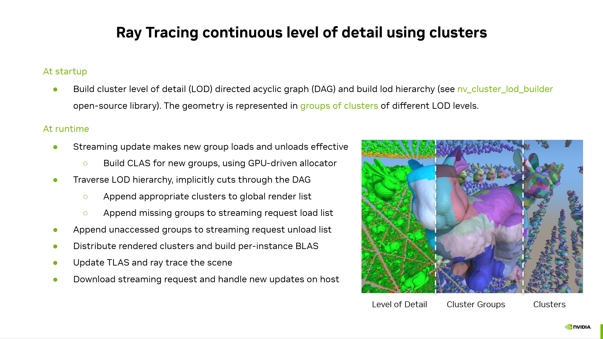
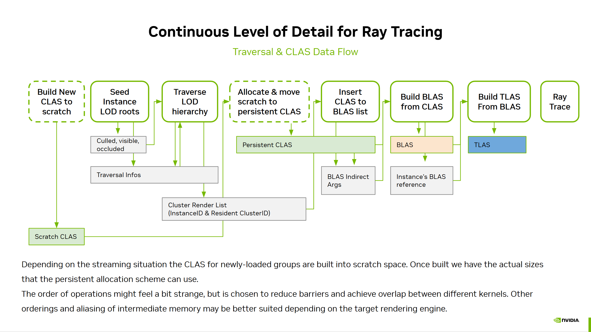
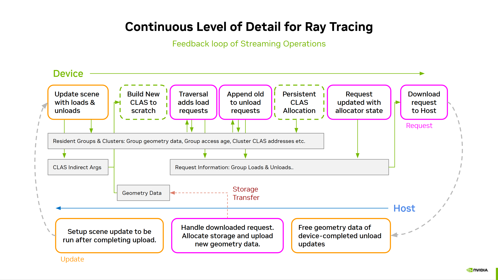
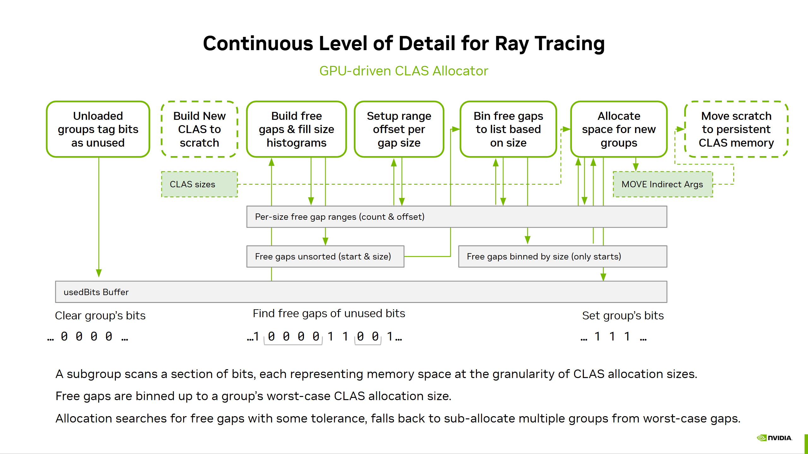

# vk_lod_clusters

This sample is part of the **NVIDIA RTX Mega Geometry** technology and showcases a continuous level of detail (LoD) technique using mesh clusters that 
leverages `VK_NV_cluster_acceleration_structure` for ray tracing. It can also rasterize the content 
using `VK_NV_mesh_shader`. Furthermore, the sample implements an on-demand streaming system from RAM to VRAM for the geometry.

In rasterization continuous LoD techniques can help performance as they reduce the impact of sub-pixel triangles.
For both ray tracing and rasterization these techniques can be combined with streaming the geometry data at
the required detail level and work within a memory budget.

This work was inspired by the Nanite rendering system for [Unreal Engine](https://www.unrealengine.com/) by Epic Games.
We highly recommend having a look at [A Deep Dive into Nanite Virtualized Geometry, Karis et al. 2021](https://www.advances.realtimerendering.com/s2021/Karis_Nanite_SIGGRAPH_Advances_2021_final.pdf).

Please have a look at the [vk_animated_clusters](https://github.com/nvpro-samples/vk_animated_clusters) to familiarize yourself with the new ray tracing cluster extension.
There are some similarities in the organization of this sample with the [vk_tessellated_clusters](https://github.com/nvpro-samples/vk_tessellated_clusters) sample.

The sample makes use of a new open-source library [nv_cluster_lod_builder](https://github.com/nvpro-samples/nv_cluster_lod_builder) to process
the model and generate the required cluster and LoD data. The LoD system is organized in groups of clusters whose meshes were simplified together.
A lot more details on this geometry representation and the LoD system can be found in the documentation of the library.

## Continuous level of detail using clusters

In principle the rendering loop is similar for rasterization and ray tracing.
The traversal of the LoD hierarchy and the interaction with the streaming system are the same.

One key difference is that for ray tracing the cluster level acceleration structures (CLAS) need to be built,
as well as the BLAS that reflects which clusters are used in an instance.
Rasterization can render directly from the original geometry data and can render from the global list of clusters
of any instance.

To allow easing into the topic, the sample has options to disable streaming as well as simplifying the CLAS
allocation or switch between rasterization and ray tracing. In the next sections we will go over how the sample 
is organized and the key operations, what functions and files to look at.

Data structures that are shared between host and device are within the `shaderio` namespace:
* [shaders/shaderio.h](/shaders/shaderio.h): Frame setup like camera and readback structure for debugging, some statistics.
* [shaders/shaderio_scene.h](/shaders/shaderio_scene.h): Key definitions to represent the scene and cluster geometry.

The scene can be rendered with or without streaming:
* [scene_preloaded.cpp](/src/scene_preloaded.cpp): simply uploads all geometry, with all clusters of all LoD levels.
* [scene_streaming.cpp](/src/scene_streaming.cpp): implements the streaming system, more details later. Enabled by default.

The full logic of the renderers is implemented in:
* [renderer_raster_clusters_lod.cpp](/src/renderer_raster_clusters_lod.cpp): Rasterization using `VK_NV_mesh_shader`
* [renderer_raytrace_clusters_lod.cpp](/src/renderer_raytrace_clusters_lod.cpp): Ray tracing using `VK_NV_cluster_acceleration_structure`. Enabled by default if available.

### Model processing

This sample is using [nv_cluster_lod_builder](https://github.com/nvpro-samples/nv_cluster_lod_builder) for generating the clusters and 
the level of detail data structures. We recommend looking at its documentation for further details.

Inside [scene.cpp](/src/scene.cpp) the `Scene:buildClusters()` function covers the usage of the library and what data we need
to extract from it.

In the UI you can influence the size of clusters and the LoD grouping of them in _"Clusters & LoDs generation"_.

At the time of writing the library does not support respecting the cluster vertex limit, so after processing this value might be increased over what
was selected in the ui. And if the upper limit of 256 is exceeded, the application will fail to load the scene for now.

### Runtime Rendering Operations

The key operation for rendering is to traverse the LoD hierarchy and build the list of
renderable clusters. For ray tracing we need to build BLAS based on that list as well.
When streaming is active, then CLAS have to be built for the clusters of the newly loaded groups (dashed outlines).
They are built into scratch space first, so the allocation logic can use their accurate build sizes
and move them to a persistent location.

All operations are performed indirectly on the device and do not require any readbacks to host.

Use _"Traversal"_ settings within the UI to influence it.

Relevant files to traversal in their usage order:
* [shaders/shaderio_building.h](/shaders/shaderio_building.h): All data structures related to traversal are stored in `SceneBuilding`
* [shaders/traversal_init.comp.glsl](/shaders/traversal_init.comp.glsl): Seeds the LoD root nodes of instances for traversal into `SceneBuilding::traversalNodeInfos`.
* [shaders/traversal_run.comp.glsl](/shaders/traversal_run.comp.glsl): Performs the hierarchical LoD traversal using a persistent kernel. Outputs the list of render clusters `SceneBuilding::renderClusterInfos`.
* [shaders/build_setup.comp.glsl](/shaders/build_setup.comp.glsl): Simple compute shader that is used to do basic operations in preparation of other kernels. Often clamping results to stay within limits.
* [shaders/blas_setup_insertion.comp.glsl](/shaders/blas_setup_insertion.comp.glsl): Sets up the per-BLAS range for the cluster references based on how many clusters each BLAS needs (which traversal computed as well).
* [shaders/blas_clusters_insert.comp.glsl](/shaders/blas_clusters_insert.comp.glsl): Fills the per-BLAS cluster references (`SceneBuilding::blasBuildInfos`) from the render cluster list. The actual BLAS build is triggered in `RendererRayTraceClustersLod::render` (look for "BLAS Build").

**Rasterization:**
Does not need the BLAS build steps and can render directly from `SceneBuilding::renderClusterInfos`.
Frustum and occlusion culling can be done to reduce the number of rendered clusters during traversal.
* [shaders/render_raster_clusters.mesh.glsl](/shaders/render_raster_clusters.mesh.glsl): Mesh shader to render a cluster.
* [shaders/render_raster.frag.glsl](/shaders/render_raster.frag.glsl)

**Ray Tracing:**
After the BLAS are built, also runs the TLAS build or update and then traces rays.
Frustum and occlusion culling only influence the LoD factors per-instance through a simple heuristic. Ray tracing will render more clusters even with culling than raster.
* [shaders/render_raytrace_clusters.rchit.glsl](/shaders/render_raytrace_clusters.rchit.glsl): Hit shader that handles shading of a hit on a cluster. There is only cluster geometry in this sample to be hit.
* [shaders/render_raytrace.rgen.glsl](/shaders/render_raytrace.rgen.glsl)
* [shaders/render_raytrace.rmiss.glsl](/shaders/render_raytrace.rmiss.glsl)

The occlusion culling is kept basic, testing the footprint of the bounding box against the appropriate mip-level of last frame's HiZ buffer and last frame's matrices. This can cause artifacts on faster motion.

### Streaming Operations

The streaming system operates at the granularity of geometry groups. One group 
contains multiple clusters that were decimated together and are seamless among each other.

Each geometry has an array that stores the device address for a group,
`Geometry::streamingGroupAddresses`, this makes it easy to access the groups from
the LoD traversal nodes. The device address is legal only if the 64-bit value is
less than `STREAMING_INVALID_ADDRESS_BEGIN` (top most bit set). If it's invalid, 
than the lower 63-bits encode the frame index when it was last added to the request
load list, to prevent adding the same missing groups multiple times in a frame.

We differentiate between "active" groups, those that can be loaded and unloaded, and
"persistent" groups, that are always loaded.

Core files for the streaming system:
* [scene_streaming.hpp](/src/scene_streaming.hpp)
* [scene_streaming.cpp](/src/scene_streaming.cpp)
* [scene_streaming_utils.hpp](/src/scene_streaming_utils.hpp)
* [scene_streaming_utils.cpp](/src/scene_streaming_utils.cpp)
* [shaders/shaderio_streaming.h](/shaders/shaderio_streaming.h)

You will notice that the key components exist both on the C++ side as well as on
the device as `shaderio` structs. Each component can manage up to `STREAMING_MAX_ACTIVE_TASKS` tasks:
- `StreamingRequest`: Array of groups are missing and should be loaded or have not been accessed and can be unloaded. (purple in the diagram).
- `StreamingResident`: The table of resident geometry groups and clusters. The table might be filled sparsely; therefore, we keep a compact array of active group indices as well.
- `StreamingStorage`: Manages the storage and transfer for dynamically loaded geometry data, as well as freeing the memory for unloads. (dark red in diagram).
- `StreamingUpdate`: Defines the update on the device for the actual loads and unloads. We might request more than we can serve. It executes after the transfer of new geometry data is completed. (orange in the diagram)

In the UI under _"Streaming"_ one can change several behaviors and limitations.
These mostly drive how much streaming requests can be handled within a single frame,
and what the upper budgets for dynamic content are. These values do not represent 
recommendations and are just arbitrary defaults.

#### Initialization

For every geometry, the lowest level of detail group is uploaded and for ray tracing
the CLAS of all clusters within are generated once and also persistently stored.

The `Geometry::streamingGroupAddresses` are filled with appropriate addresses for
those persistently loaded groups, and the rest of the groups are set to be invalid.

The memory limits in the configuration do not cover this persistently loaded data,
which is always allocated.

However, when we register these persistent groups in the `StreamingResident` object table,
they do count against the limit of the table size. We automatically increase the
table size to at least have enough space to hold all low detail groups.

#### Runtime

The streaming system is frame-based. Each frame we trigger some tasks
and always initiate the streaming request task. There can be only one
task per kind applied on the device.

All these operations for a frame are configured within the `shaderio::SceneStreaming` struct that is filled
in `SceneStreaming::cmdBeginFrame` and accessible as both UBO and SSBO in the shaders.

We go through the core steps of streaming process in chronological order from the perspective of a request:

1. On the device we fill in the request task details.
   
   During traversal missing geometry groups are appended to the request
   load array.
   See `USE_STREAMING` within [shaders/traversal_run.comp.glsl](/shaders/traversal_run.comp.glsl),
   which is called by the renderer.
   After traversal any groups that have not been accessed in a while are 
   appended to the request unload array. 
   
   See [shaders/stream_agefilter_groups.comp.glsl](/shaders/stream_agefilter_groups.comp.glsl)
   which is called in `SceneStreaming::cmdPostTraversal`
   At the end of the frame we download the request to host in
   `SceneStreaming::cmdEndFrame`.

2. The request is handled on the host after checking its availability.
   
   The actual number of loads to perform is adjusted based on the available per-frame
   limits and if we can stay within the memory budget.
   The operation triggers the storage upload of newly loaded geometry groups via a `StreamingStorage` task.
   It also prepares a `StreamingUpdate` task, which encodes the patching of the scene
   and an update to the resident object table. Along with this is a `StreamingResident` task
   that provides the new state of active group indices.

   See `SceneStreaming::handleCompletedRequest`

3. Once the storage upload is completed, the appropriate update task is run.
   This update task actually patches the device side buffers so the loads
   and unloads become effective.
   When ray tracing is active, we will also build - on device - the CLAS of the newly loaded
   groups and handle their allocation management along with the patching.

   See [shaders/stream_update_scene.comp.glsl](/shaders/stream_update_scene.comp.glsl)
   run within `SceneStreaming::cmdPreTraversal`

   CLAS allocation management is done either through a persistent
   allocator system (`stream_allocator...` shader files) or through a simple
   compaction system (`stream_compaction...` shader files). More about that
   later.

4. After the update task is completed on the device the host can
   safely release the memory of unloaded groups. This memory is then
   recycled when we load new geometry groups at step (2).

   See the beginning of `SceneStreaming::cmdBeginFrame`.

This concludes the lifetime of a request from initial recording to all 
its dependent operations being completed.

Overall, both loading and unloading strategies are rather basic and there is room for improvement. 
Loading is purely based on the traversal, we expect that sorting the instances by camera distance 
and then seeding traversal nodes accordingly will help loading with priority around
the camera.

The streaming system has quite some configurable options, mostly balancing how 
many operations should be done within a single frame.
There is also the ability to use an asynchronous transfer queue for the data uploads,
otherwise we just upload on the main queue prior to the patch operations.

The provided defaults have not been tuned by any means and are not be seen as
recommendations.

Lastly, another major option is how the CLAS are allocated within the
fixed size CLAS buffer. Since the actual size of a CLAS is only
known on the device after it was built and the estimates from the host
can be a lot higher. We used solutions that can be implemented
on the device, not relying on further host readbacks but still
trying to make efficient use of the memory based on actual sizes.

Two options are provided, and they both first build new CLAS into
scratch space before moving them to their resident location.

- **Simple CLAS Compaction:**
  This simple scheme is based on a basic compaction algorithm that - on the device - 
  packs all resident cluster CLAS tightly before appending newly built ones.
  This can cause bursts of high amount of memory movement and a lot of bandwidth 
  and scratch space consumption. This is despite the fact that the new cluster
  API does provide functionality for moving objects to overlapping memory destinations.
  
  We do not recommend this, but it is the easiest way to get going.

  See `stream_compaction...` shader files

- **Persistent CLAS Allocator:**
  In this option we implement a persistent memory manager on the device
  so that CLAS-s are moved only once after initial building. See more
  in next chapter.

### GPU-Driven CLAS Allocation

The goal of the persistent CLAS allocator is to provide a persistent 
CLAS memory location with a fixed budget CLAS buffer. This means we need
to move the CLAS only once from its scratch space to a permanent location.
We later reclaim that memory when the group owning the CLAS is unloaded.

The implementation is completely on the device and does not require the host.
However, we need to read back the status of the free space to the host, so that
it can guarantee not to schedule newly loaded groups that are not guaranteed to fit.

Building the CLAS into scratch space first allows us to easily access the actual
size of the CLAS when making the allocation. While upper bounds can be
queried on the host, they are typically far from the real consumption,
and we want to benefit from tight packing.

The allocator represents the memory usage in a bit array based on the granularity of
CLAS sizes. As of writing the minimum granularity is 128 bytes and
can be increased further in the UI via _"Allocator granularity shift bits"_.
This granularity forms the basic "units" that the allocator operates in.
All sizes, offsets etc. are based on these units and they map to range of 
bits in the big array.

The bits are set during allocation, and cleared during deallocation. We allocate
on a per-group level and allocation sizes are at minimum 32 units.

We scan a sector of bits within a single subgroup to find free gaps.
The default number of sector bits is expressed in shifting the value of 32, i.e. `32 << 10`
 (_"Allocator sector shift bits"_ is set to 10 in UI). The free gaps are clamped in their 
size to the maximum group allocation size we can ever get. Which is computed
by `maximumClasSize * clustersPerGroup`. The former is queried from the driver
based on the maximum number of cluster triangles and vertices, the latter was a setting
of how we configured the cluster LoD builder.

Following operations are performed per frame:

1. If there is groups to be unloaded as part of the update task,
   then execute [shaders/stream_allocator_unload_groups.comp.glsl](/shaders/stream_allocator_unload_groups.comp.glsl)
   to clear the appropriate bits.
2. If there was unloading, or we do new loading of groups we need to build
   the list of free gaps that the allocator can use. This is done in a few steps. First, we run
   [shaders/stream_allocator_build_freegaps.comp.glsl](/shaders/stream_allocator_build_freegaps.comp.glsl)
   which finds the gaps in sector bits and writes them out in an unsorted fashion into
   `StreamingAllocator::freeGapsPos` and `StreamingAllocator::freeGapsSize`. We also 
   bump the histogram over the various gap sizes, `StreamingAllocator::freeSizeRanges[size].count`.
3. We reset a global gap count via using `STREAM_SETUP_ALLOCATOR_FREEINSERT` in [shaders/stream_setup.glsl](/shaders/stream_setup.comp.glsl)
4. Using the global gap counter and the `StreamingAllocator::freeSizeRanges[size].count` the offset
   `StreamingAllocator::freeSizeRanges[size].offset` is computed for each size within 
   [shaders/stream_allocator_setup_insertion.comp.glsl](/shaders/stream_allocator_setup_insertion.comp.glsl).
   The shader resets the per-size counts.
5. Now the free gaps are binned by their size into the per-size array ranges that were just computed.
   [shaders/stream_allocator_freegaps_insert.comp.glsl](/shaders/stream_allocator_freegaps_insert.comp.glsl) is 
   responsible for this operation.
6. Finally, we have all the data to do the allocation of newly loaded groups.
   Details can be found in [shaders/stream_allocator_load_groups.comp.glsl](/shaders/stream_allocator_load_groups.comp.glsl).
   We compute the group's required allocation size from its CLAS sizes and then look for 
   free gaps of the same size or slightly bigger.
   When nothing is found, we will attempt to make bigger allocations combining multiple groups that didn't find a gap.
   Last but not least we will sub-allocate from the worst-case sized allocation gaps. We have guaranteed on the host
   that we would never trigger more loads than we have worst-case free space for.
7. To ensure this guarantee, after the allocation is completed, we store the state of the worst-case gap sizes that are left into the 
   currently recorded request task information.
   This is done by running `STREAM_SETUP_ALLOCATOR_STATUS` in [shaders/stream_setup.glsl](/shaders/stream_setup.comp.glsl)

In future versions we will try to optimize this scheme a bit further.

## Problem-Solving

The technology being quite new, we might not have ironed out all issues. If you experience instabilities, please let us know through GitHub Issues.
You can use the commandline to change some defaults:

* `-renderer 0` starts with rasterization.
* `-supersample 0` disables the super sampling that otherwise doubles rendering resolution in each dimension. 
* `-clasallocator 0` disables the more complex gpu-driven allocator when streaming
* `-gridcopies N` set the number of model copies in the scene.
* `-gridunique 0` disables the generation of unique geometries for every model copy. Greatly reduces memory consumption by truly instancing everything. By default on to stress streaming.
* `-streaming 0` disables streaming system and uses preloaded scene (warning this can use a lot of memory, use above `-gridunique 0` to reduce)
* `-vsync 0` disable vsync. If changing vsync via UI does not work, try to use the driver's *NVIDIA Control Panel* and set `Vulkan/OpenGL present method: native`.

## Limitations

* The `ClusterID` can only be accessed in shaders using  `gl_ClusterIDNV` after enabling `VkRayTracingPipelineClusterAccelerationStructureCreateInfoNV::allowClusterAccelerationStructures` for that pipeline.
  We use `GL_EXT_spirv_intrinsics` rather than dedicated GLSL extension support that may come at a later time.
* Few error checks are performed on out of memory situations, which can happen on higher _"render copies"_ values, or the complexity of the loaded scene
* If the cluster library generates clusters > 256 vertices, scene loading will fail. This should be addressed in future versions.
* The number of threads used in the persistent kernel is basd on a crude heuristic for now and was not evaluated to be the optimal amount.

## Future Improvements

* Sort instances by proximity to the camera and seed traversal in such order. This will help loading objects close to the camera first.
* Detecting instances with lowest detail could allow re-using a single persistent lowest-detail BLAS, rather than building one per-instance all the time.
* Using this LOD system for minification and tessellation for magnification is another use-case we intend to demonstrate in a future sample.
* Further optimizations to the allocator
* Ray tracing could use culling information better. Currently there is a simple logic that just lowers the LoD factors when an instance is culled by frustum or HiZ.
* Improve performance of the library that builds the cluster lod system.
* Allowing the use of a compute shader to do rasterization of smaller/non-clipped triangles.
* EXT_mesh_shader support

## Building and Running

The new `VK_NV_cluster_acceleration_structure` extension requires new drivers, earliest release version is `572.16` from 1/30/2025.
The sample should run on older drivers with just rasterization available.

Point cmake to the `vk_lod_clusters` directory and for example set the output directory to `/build`.
We recommend starting with a `Release` build, as the `Debug` build has a lot more UI elements.

The cmake setup will download the `Stanford Bunny` glTF 2.0 model that serves as default scene.

It will also look for [`nvpro_core`](https://github.com/nvpro-samples/nvpro_core) either as subdirectory of the current project directory, or up to two levels above. If it is not found, it will automatically download the git repo into `/build/_deps`.
Note, that the repository of `nvpro_core` needs to be updated manually in case the sample is updated manually, as version mismatches could occur over time.

The Vulkan validation layers may interfere with extensions it doesn't know about, therefore it is currently disabled in debug builds.
This will be changed with future Vulkan SDKs.

## Further Samples about NVIDIA RTX Mega Geometry

Other Vulkan samples using the new extensions are:
- https://github.com/nvpro-samples/vk_animated_clusters - showcases basic usage of new ray tracing cluster extension.
- https://github.com/nvpro-samples/vk_lod_clusters - provides a sample implementation of a basic cluster-LoD based rendering and streaming system.
- https://github.com/nvpro-samples/vk_partitioned_tlas - New extension to manage incremental TLAS updates.

We also recommend having a look at [NVIDIA GameWorks RTX Mega Geometry (coming soon)](https://github.com/NVIDIAGameWorks/RTX-Megageometry), which demonstrates tessellation of subdivision surfaces in DirectX 12.

## Additional Scenes

We prepared two more scenes to play with. They are based on models from [https://threedscans.com/](https://threedscans.com/):
- [threedscans_animals](http://developer.download.nvidia.com/ProGraphics/nvpro-samples/threedscans_animals.zip)
  - 7.9 M Triangles
  - ~ 1.4 GB preloaded memory
  - 290 MB zip
- [threedscans_statues](http://developer.download.nvidia.com/ProGraphics/nvpro-samples/threedscans_statues.zip)
  - 6.9 M Triangles
  - ~ 1.3 GB preloaded memory
  - 280 MB zip

These models can take minutes to load, due to the processing into the cluster lod system, even on systems with many CPU cores.

## Third Party

[meshoptimizer](https://github.com/zeux/meshoptimizer) is used during the mesh simplification process when the triangles within a cluster are re-ordered to improve triangle strips.
