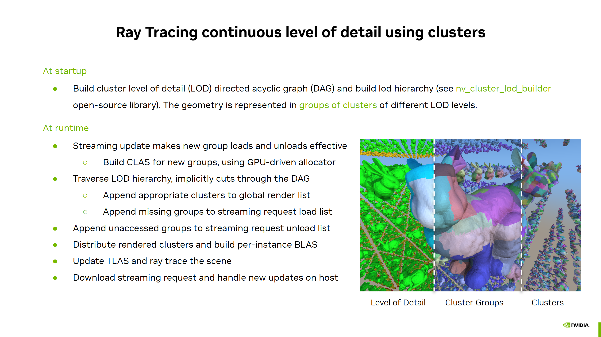
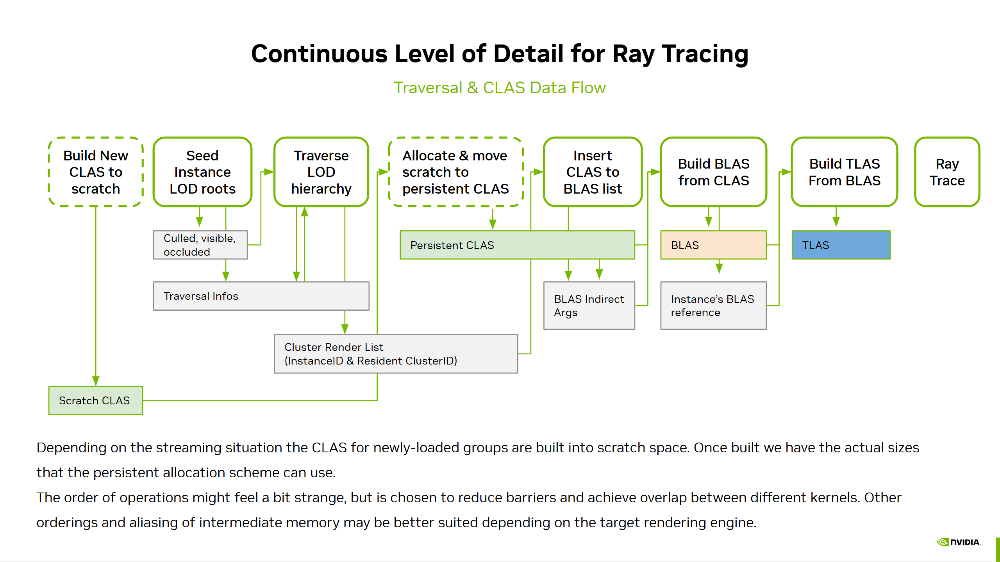
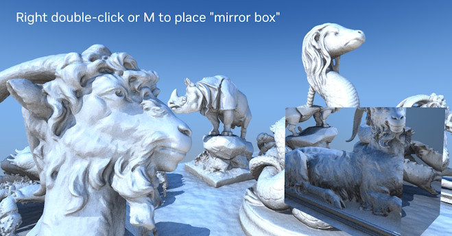
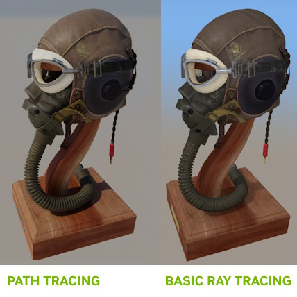
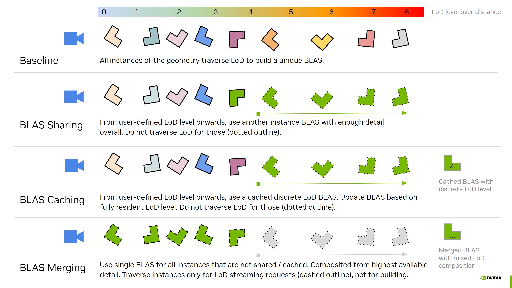
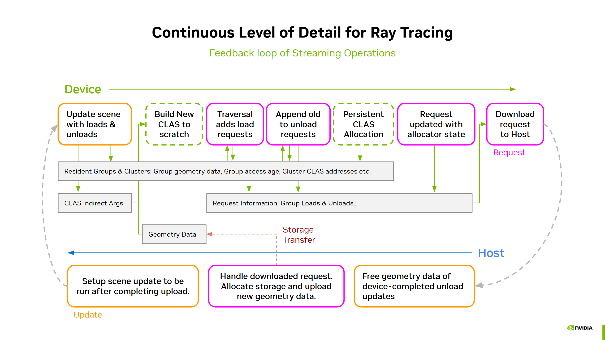
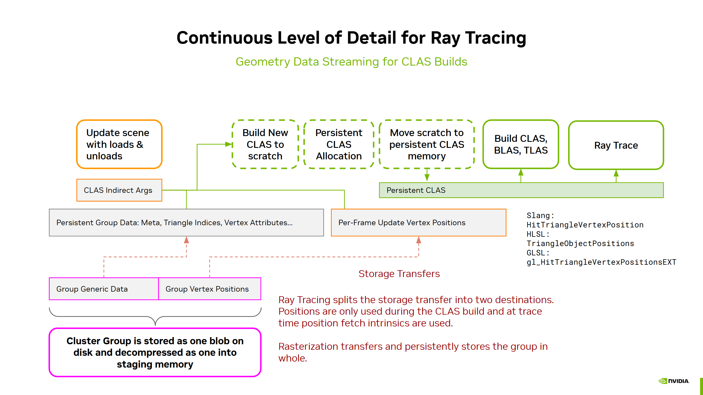
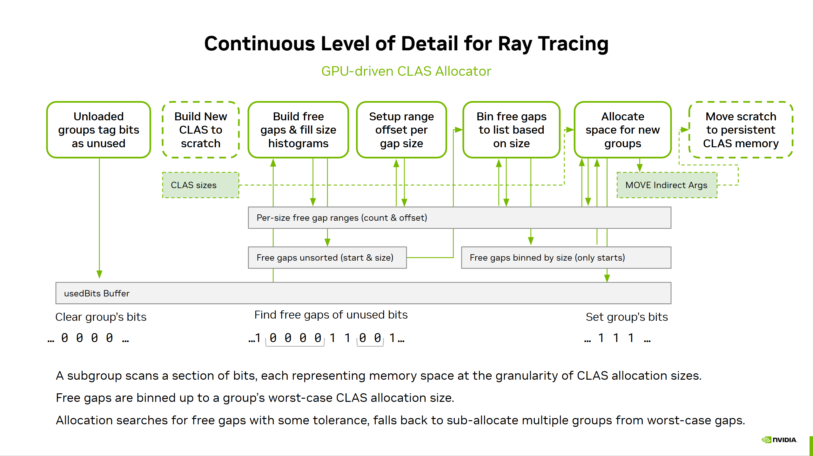

# vk_lod_clusters

This sample is demonstrating the **NVIDIA RTX Mega Geometry** technology with a continuous level of detail (LoD) technique using mesh clusters that 
leverages [`VK_NV_cluster_acceleration_structure`](https://registry.khronos.org/vulkan/specs/latest/man/html/VK_NV_cluster_acceleration_structure.html) for ray tracing. It can also rasterize the content 
using `VK_EXT/NV_mesh_shader`. Furthermore, the sample implements an on-demand streaming system from RAM to VRAM for the geometry.

In rasterization continuous LoD techniques can help performance as they reduce the impact of sub-pixel triangles.
For both ray tracing and rasterization these techniques can be combined with streaming the geometry data at
the required detail level and work within a memory budget.

This work was inspired by the Nanite rendering system for [Unreal Engine](https://www.unrealengine.com/) by Epic Games.
We highly recommend having a look at [A Deep Dive into Nanite Virtualized Geometry, Karis et al. 2021](https://www.advances.realtimerendering.com/s2021/Karis_Nanite_SIGGRAPH_Advances_2021_final.pdf).

Please have a look at the [vk_animated_clusters](https://github.com/nvpro-samples/vk_animated_clusters) to familiarize yourself with the new ray tracing cluster extension.
There are some similarities in the organization of this sample with the [vk_tessellated_clusters](https://github.com/nvpro-samples/vk_tessellated_clusters) sample.

The sample makes use of the [meshoptimizer](https://github.com/zeux/meshoptimizer) library to process
the model and generate the required cluster and LoD data. The LoD system is organized in groups of clusters whose meshes were simplified together.

## Continuous level of detail using clusters

For some basic description what data structures the continuous LoD system uses and how it works please look [here](docs/lod_generation.md).

In principle the rendering loop is similar for rasterization and ray tracing.
The traversal of the LoD hierarchy and the interaction with the streaming system are the same.

One key difference is that for ray tracing the cluster level acceleration structures (CLAS) need to be built,
as well as the bottom level acceleration structure (BLAS) that reflects which clusters are used in an instance.
Rasterization can render directly from the original geometry data and can render from the global list of clusters
of any instance.

To allow easing into the topic, the sample has options to disable streaming as well as simplifying the CLAS
allocation or switch between rasterization and ray tracing. In the next sections we will go over how the sample 
is organized and the key operations, what functions and files to look at.

Data structures that are shared between host and device are within the `shaderio` namespace:
* [shaders/shaderio.h](/shaders/shaderio.h): Frame setup like camera and readback structure for debugging, some statistics.
* [shaders/shaderio_scene.h](/shaders/shaderio_scene.h): Key definitions to represent the scene and cluster geometry.

The scene can be rendered with or without streaming:
* [scene_preloaded.cpp](/src/scene_preloaded.cpp): simply uploads all geometry, with all clusters of all LoD levels.
* [scene_streaming.cpp](/src/scene_streaming.cpp): implements the streaming system, more details later. Enabled by default.

The full logic of the renderers is implemented in:
* [renderer_raster_clusters_lod.cpp](/src/renderer_raster_clusters_lod.cpp): Rasterization using `VK_NV_mesh_shader` or `VK_EXT_mesh_shader`
* [renderer_raytrace_clusters_lod.cpp](/src/renderer_raytrace_clusters_lod.cpp): Ray tracing using `VK_NV_cluster_acceleration_structure`. Enabled by default if available.

The sample also showcases a ray tracing specific optimization for [BLAS Sharing](docs/blas_sharing.md).

### Model processing

This sample uses a lightly modified copy of [meshoptimizer's](https://github.com/zeux/meshoptimizer) single header [clusterlod.h](src/meshopt_clusterlod.h). The local changes are listed at the top of the file.

Inside [scene_cluster_lod.cpp](/src/scene_cluster_lod.cpp) the `Scene::buildGeometryLod(...)` function covers the usage of the libraries and what data we need to extract from them. The `Scene::storeGroup(...)` function takes the resulting cluster group and packs it into a binary blob used for the runtime representation. The geometry data is later saved into the cache file for faster loading and streaming.

The cluster group can be compressed using a lossless compression scheme. However, we recommend the dropping of mantissa bits for both vertex positions and UV coordinates.
The compression is done in the `Scene::compressGroup(...)` function inside [scene_cluster_compression.cpp](/src/scene_cluster_compression.cpp). Vertex positions and UV coordinates go through a bit-packing scheme, while the triangle indices of each cluster are encoded with `meshoptimizer`'s meshlet codec (`meshopt_encodeMeshlet`), which typically shrinks them by around 3x. Clusters that carry per-triangle materials store those through a per-cluster palette, as such a cluster usually mixes only two or three distinct values even when its geometry has many material slots. Groups are decoded back on the CPU in `Scene::decompressGroup(...)` before they are uploaded, which is fast enough to sit in the streaming path.

In the UI you can influence the size of clusters and the LoD grouping of them in _"Clusters & LoDs generation"_.

Per-mesh simplification overrides (`--simplifyoverrides`), the processing cache file and the options to control its memory and thread usage are covered in the [Scene Processing documentation](docs/scene_processing.md).

> [!WARNING]
> The processing of larger scenes can take a while, even on CPUs with many cores. Therefore the application automatically saves
> an uncompressed cache file next to the original file with a `.nvsngeo` file ending. This file can take a lot of space and existing
> cache files are overwritten without warning. There are only few compatibility checks, we recommend deleting it if the original input mesh changed.

The model loader can make use of these glTF 2.0 Extensions:
- [EXT_meshopt_compression](https://github.com/KhronosGroup/glTF/blob/main/extensions/2.0/Vendor/EXT_meshopt_compression/README.md)
- [EXT_mesh_gpu_instancing](https://github.com/KhronosGroup/glTF/blob/main/extensions/2.0/Vendor/EXT_mesh_gpu_instancing/README.md) (With the restriction that buffers referenced by its accessors must **not** be compressed)

### Runtime Rendering Operations

The key operation for rendering is to traverse the LoD hierarchy and build the list of
renderable clusters. For ray tracing we need to build BLAS based on that list as well.
When streaming is active, then CLAS have to be built for the clusters of the newly loaded groups (dashed outlines).
They are built into scratch space first, so the allocation logic can use their accurate build sizes
and move them to a persistent location.

All operations are performed indirectly on the device and do not require any readbacks to host.

Use _"Traversal"_ settings within the UI to influence it.

Relevant files to traversal in their usage order:
* [shaders/shaderio_building.h](/shaders/shaderio_building.h): All data structures related to traversal are stored in `SceneBuilding`
* [shaders/traversal_init.comp.glsl](/shaders/traversal_init.comp.glsl): Seeds the LoD root nodes of instances for traversal into `SceneBuilding::traversalNodeInfos`. Implements a shortcut to directly insert the low detail cluster into `SceneBuilding::renderClusterInfos` if only the furthest LoD would be traversed (also skips BLAS building for ray tracing).
* [shaders/traversal_run.comp.glsl](/shaders/traversal_run.comp.glsl): Performs the hierarchical LoD traversal. Outputs the list of render clusters `SceneBuilding::renderClusterInfos`.
* [shaders/build_setup.comp.glsl](/shaders/build_setup.comp.glsl): Simple compute shader that is used to do basic operations in preparation of other kernels. Often clamping results to stay within limits.
* [shaders/blas_setup_insertion.comp.glsl](/shaders/blas_setup_insertion.comp.glsl): Sets up the per-BLAS range for the cluster references based on how many clusters each BLAS needs (which traversal computed as well). This also determines how many BLAS are built at all.
* [shaders/blas_clusters_insert.comp.glsl](/shaders/blas_clusters_insert.comp.glsl): Fills the per-BLAS cluster references (`SceneBuilding::blasBuildInfos`) from the render cluster list. The actual BLAS build is triggered in `RendererRayTraceClustersLod::render` (look for "BLAS Build").
* [shaders/instances_assign_blas.comp.glsl](/shaders/instances_assign_blas.comp.glsl): After BLAS building assigns the built BLAS addresses to the TLAS instance descriptors prior building the TLAS.

**Rasterization:**
Does not need the BLAS and TLAS build steps and can render directly from `SceneBuilding::renderClusterInfos`.
Frustum and occlusion culling can be done to reduce the number of rendered clusters during traversal.
How the occlusion culling deals with the current frame's depth not existing yet is described in the
[Rasterization Two-Pass Culling documentation](docs/raster_twopass_culling.md).
* [shaders/render_raster_clusters.mesh.glsl](/shaders/render_raster_clusters.mesh.glsl): Mesh shader to render a cluster.
* [shaders/render_raster_clusters_sw.comp.glsl](/shaders/render_raster_clusters.mesh.glsl): Compute shader to rasterize a cluster. It is only used when the "Allow SW-Raster" traversal option is active.
* [shaders/render_raster.frag.glsl](/shaders/render_raster.frag.glsl)

When `USE_DLSS` is enabled at build time, rasterization supports **DLSS Super Resolution (DLSS-SR)** to upscale a lower-resolution render target (requires `--renderer 0` or the rasterizer UI option). The motion-vector render target stays bound whenever DLSS-SR is active; only _shaded_ hardware rasterization writes motion vectors (SW-raster and other non-shaded modes disable color writes on that attachment and clear it each frame).

Rasterization can optionally skip the LoD hierarchy traversal for distant instances through _"Discrete LoD"_
(`--discretelod`, off by default): an instance that gets by with a single, fully resident, discrete LoD level seeds the
traversal at that level's node and renders the level as a whole. It is the rasterization counterpart to
[BLAS Caching](docs/blas_caching.md) and mostly interesting for a hybrid renderer, where it lets rasterization and ray
tracing converge on the same resident geometry. Please have a look at the
[Discrete LoD documentation](docs/raster_discrete_lod.md).

In some conditions (visualize == visibility buffer, culling on) one can enable the usage of a basic compute-shader based rasterizer. However it hasn't been tuned yet and in typical usage scenarios is not faster than the mesh-shader because clusters tend to have larger than single pixel triangles. You can look for `USE_SW_RASTER` in the code where it does affect traversal.

**Ray Tracing:**
After the BLAS are built, also runs the TLAS build or update and then traces rays.
Frustum and occlusion culling only influence the LoD factors per-instance through a simple heuristic. Ray tracing will render more clusters even with culling than raster.

Use the "Mirror Box" effect (double right-click or M key) to investigate the impact on geometry that is outside the frustum or
otherwise occluded.

There is two sets of shaders, and their usage depends on whether _Path Tracing_ is enabled. They have a slightly different configuration. The default / basic set of shaders do shading in the hit-shader, whilst path-tracing does shading in the ray generation shader. Overall the material complexity in this sample is intentionally kept low and we recommend to have a look at [vk_gltf_renderer](https://github.com/nvpro-samples/vk_gltf_renderer) for more fidelity. Path tracing uses the physical sky model, whilst the other options use a simplified version.

Basic shaders:

* [shaders/render_raytrace_clusters.rchit.glsl](/shaders/render_raytrace_clusters.rchit.glsl): Hit shader that handles shading of a hit on a cluster. There is only cluster geometry in this sample to be hit.
* [shaders/render_raytrace_clusters.rahit.glsl](/shaders/render_raytrace_clusters.rahit.glsl): Any hit shader for alpha-masked materials.
* [shaders/render_raytrace.rgen.glsl](/shaders/render_raytrace.rgen.glsl): Ray generation shader, also implements the simple mirror effect.
* [shaders/render_raytrace.rmiss.glsl](/shaders/render_raytrace.rmiss.glsl): Miss shader.

Path tracing shaders:

* [shaders/render_pathtrace_clusters.rchit.glsl](/shaders/render_pathtrace_clusters.rchit.glsl): Hit shader that provides minimal information back to the ray generation shader.
* [shaders/render_pathtrace_clusters.rahit.glsl](/shaders/render_pathtrace_clusters.rahit.glsl): Any hit shader for alpha-masked materials.
* [shaders/render_pathtrace.rgen.glsl](/shaders/render_pathtrace.rgen.glsl): Ray generation shader that handles the multi-bounce path tracing as well as the material evaluation.
* [shaders/render_pathtrace.rmiss.glsl](/shaders/render_pathtrace.rmiss.glsl) Miss shader.

The ray tracing code path can optimize the number of BLAS builds through _"BLAS Sharing"_, which allows instances to use the BLAS
from another instance.

Please have a look at the [BLAS Sharing documentation](docs/blas_sharing.md), as well as
[BLAS Merging](docs/blas_merging.md) and [BLAS Caching](docs/blas_caching.md), which build on it.

The _"blas reuse"_ visualization shows which of these an instance ended up using, greener the more its BLAS is reused:

* **green**: the pre-built low detail BLAS, or the geometry's cached BLAS
* **yellow**: another instance's BLAS, through sharing
* **orange**: the geometry's merged BLAS
* **red**: a BLAS that was built for this instance alone in this frame

The occlusion culling is kept basic, testing the footprint of the bounding box against the appropriate mip-level of last frame's HiZ buffer and last frame's matrices. This can cause artifacts on faster motion. Rasterization can avoid those with the two-pass variants, see [Rasterization Two-Pass Culling](docs/raster_twopass_culling.md).

### Streaming Operations

There are a few settings in the UI to throttle the streaming traffic that is allowed per-frame.

Please have a look at the [Streaming Operations documentation](docs/streaming.md).

There is one distinct difference between rasterization and ray tracing. Ray tracing will store the vertex positions into a temporary space used only during CLAS building, while rasterization will keep the positions persistently along with the group. As ray tracing allows fetching the positions at hit-time through intrinsics, there is no direct need to keep the data around.

### GPU-Driven CLAS Allocation

> [!IMPORTANT] Resizable CLAS storage through sparse buffer usage
> We are leveraging a sparse buffer for the CLAS allocation, so we can grow it on demand. For this we read back the information about
> actual CLAS sizes from the GPU-side allocation manager.
> This is crucial as the host-side estimates are way too conservative (e.g. often 3-5x bigger than actual). The CLAS 
> buffer is sized in such a way that it can fit N-frames worth of worst-case sized CLAS builds.
> The streaming manager is configured for a certain number of CLAS builds per frame, and N defines the maximum frame latency
> between GPU-produced allocation data and CPU readback/decision-making.

Please have a look at the [GPU-Driven CLAS Allocation documentation](docs/clas_allocation.md)

## Problem-Solving

The sample uses a lot of technologies and has many configurations. We don't have a lot of test coverage for it. If you experience instabilities, please let us know through GitHub Issues.
You can use the commandline to change some defaults, some examples:

* `--renderer 0` starts with rasterization.
* `--supersample 0` disables the super sampling that otherwise doubles rendering resolution in each dimension. 
* `--clasallocator 0` disables the more complex gpu-driven allocator when streaming and uses the simple move based CLAS compaction instead. That scheme relocates all resident CLAS on every unload, so BLAS caching (which keeps a BLAS built from CLAS addresses across frames) has no effect while it is used.
* `--gridcopies N` set the number of model copies in the scene.
* `--streaming 0` disables streaming system and uses preloaded scene (warning this can use a lot of memory, use `--gridunique 0` to reduce)
* `--vsync 0` disable vsync. If changing vsync via UI does not work, try to use the driver's *NVIDIA Control Panel* and set `Vulkan/OpenGL present method: native`.
* `--autoloadcache 0` disables loading scenes from cache file.

`--help` prints all available options, more noteworthy ones are described in the
[Command-line Options documentation](docs/commandline.md).

## Camera Path

A camera path is a keyframed fly-through that can be authored in the UI, is copy/paste friendly and can be provided on the command line.
Its main purpose is **deterministic benchmarking**: `--runcamerapath <index> <framecount>` spreads a path across exactly that many rendered frames, independent of frame rate or GPU speed.

Please have a look at the [Camera Path documentation](docs/camera_paths.md) for the UI, the string format and a benchmarking setup.

## Materials

The sample supports simple colored materials, alpha-masked materials, and (optionally) textured PBR shading.
However, the shading quality is kept rather basic given the focus was geometry in this sample. For higher quality
shading with a lot more features please refer to [vk_gltf_renderer](https://github.com/nvpro-samples/vk_gltf_renderer)
or [RTXMG SDK](https://github.com/NVIDIA-RTX/RTXMG).

Textured PBR is disabled by default, enable it with `--multimaterials 1 --attributes 7 --texturedmaterials 1`.
Textures must be external `dds` or `ktx2` files and are loaded at scene init, they are not streamed with the geometry.

Please have a look at the [Materials documentation](docs/materials.md) for the UI equivalents and the restrictions.

## Limitations

* The `ClusterID` can only be accessed in shaders using  `gl_ClusterIDNV` after enabling `VkRayTracingPipelineClusterAccelerationStructureCreateInfoNV::allowClusterAccelerationStructure` for that pipeline.
  We use `GL_EXT_spirv_intrinsics` rather than the dedicated GLSL extension support.
* Few error checks are performed on out of memory situations, which can happen on higher _"render copies"_ values, or the complexity of the loaded scene
* The number of threads used in the persistent kernel is based on a crude heuristic for now and was not evaluated to be the optimal amount. The Persistent kernel is deactivated for non-NVIDIA hardware.
* The bounding box visualizations don't show for ray tracing when DLSS denoising is active, and they will only show clusters that are part of BLAS builds in the current frame. Prefer using rasterization to see them.
* DLSS Super Resolution (rasterization): motion-vector render target is always bound; only shaded HW raster writes it. HBAO is disabled while DLSS-SR is active.
* Material textures (PBR and alpha-mask) are loaded at scene init and are not streamed, even when geometry streaming is enabled. Use `--maxtexturemegabytes` (default 4096) to cap total texture VRAM; see [Materials](docs/materials.md).
* Alpha-masked materials: 
  - Always uses texture coordinate 0 independent of glTF material's texcoord. 
  - Does require enabling texture coordinate loading (`--attributes <bitflag containing 4>` or ui).
  - May need multi-material support for glTF meshes (`--multimaterials 1` or ui). The textures must be provided as `ktx2` or `dds`. Textures are fully loaded into VRAM at scene init (not streamed).
  - See also [Materials](docs/materials.md) for full PBR texturing restrictions.
* `doubleSided` materials:
  - Are a lot slower with `EXT_mesh_shader` than with `NV_mesh_shader` on NVIDIA hardware. Primitive culling is still exclusive to NV_mesh_shader, given there is no reasonable portable and fast way for EXT_mesh_shader.
  - Are only accurately done for multi-material meshes if alpha-masking is properly enabled.
* Tangent space must be provided with the glTF meshes if normal maps are used, there is no automatic generation of these.

## Future Improvements

* Partitioned TLAS support for scenes with many instances.
* Further techniques to reduce memory consumption.
* Improve streaming performance.
* Add texture streaming for material textures (long term).

## Building and Running

Requires at least Vulkan SDK 1.4.341.0

The `VK_NV_cluster_acceleration_structure` extension is available since driver version `572.16` from 1/30/2025.
The sample should run on older drivers with just rasterization available.

Point cmake to the `vk_lod_clusters` directory and for example set the output directory to `/build`.
We recommend starting with a `Release` build, as the `Debug` build has a lot more UI elements.

The cmake setup will download the `Stanford Bunny` glTF 2.0 model that serves as default scene.

If `USE_DLSS` is activated in the cmake options, then the DLSS/NGX runtime is downloaded by cmake setup as well:

* **Ray tracing:** DLSS Ray Reconstruction (DLSS-RR) denoising for the path-traced output (`DLSS - RR` in the UI, or `--dlss 1` with the ray tracer).
* **Rasterization:** DLSS Super Resolution (DLSS-SR) upscales a jittered lower-resolution render (`DLSS - SR` in the UI, or `--dlss 1` with `--renderer 0`). Motion vectors are written only in shaded HW-raster mode.

Use `--dlssquality` or the UI quality preset to control the performance/quality trade-off.

It will also look for [`nvpro_core2`](https://github.com/nvpro-samples/nvpro_core2) either as subdirectory of the current project directory, or up to two levels above. If it is not found, it will automatically download the git repo into .

> [!IMPORTANT]
> Note, that the repository of `nvpro_core2` needs to be updated manually, when the sample is updated manually, as version mismatches could occur over time. Either run the appropriate git commands or delete `/build/_deps/nvpro_core2`.

### Interactions

* `WASD` and `QE` to control the camera. `SHIFT` for faster speed, `CTRL` for slower. `ALT` to orbit around the last hit point.
* `SPACE` or `double left click` to get a surface hit point that the camera will orient itself to. This also adjusts the walking speed based on a percentage of the distance to the point. Meaning close by hit points will cause slower walk than points further in the distance.
* `M` or `double right click` to on a surface hit point to generate the reflective mirror box in ray tracing. Trigger this on the sky to make it disappear.
* `R` to reload the shaders (meant for debugging).
* `P` to isolate an object and `SHIFT+P` to isolate the cluster (both raster only).
  
## Further Samples about NVIDIA RTX Mega Geometry

Other Vulkan samples using the new extensions are:
- https://github.com/nvpro-samples/vk_animated_clusters - showcases basic usage of new ray tracing cluster extension.
- https://github.com/nvpro-samples/vk_lod_clusters - provides a sample implementation of a basic cluster-LoD based rendering and streaming system.
- https://github.com/nvpro-samples/vk_partitioned_tlas - New extension to manage incremental TLAS updates.

We also recommend having a look at [RTX Mega Geometry](https://github.com/NVIDIA-RTX/RTXMG), which demonstrates tessellation of subdivision surfaces as well as a continuous LoD system ported from this sample.

## Additional Scenes

Downloads, hardware requirements, processing command lines and known issues for all of them are in the [Additional Scenes documentation](docs/scenes.md).

### Zorah Demo Scene

A glTF export of the highly detailed raw geometry from the [NVIDIA RTX Kit - Zorah Sample](https://developer.nvidia.com/rtx-kit?sortBy=developer_learning_library) as [presented at GDC 2025](https://developer.nvidia.com/blog/nvidia-rtx-advances-with-neural-rendering-and-digital-human-technologies-at-gdc-2025/).
Available with textures (`zorah_textured_public` ~ 130 GB on disk with render cache) or geometry-only (`zorah_main_public` ~ 35 GB), you only need one of them.
Must be streamed, cannot be pre-loaded. See [Additional Scenes](docs/scenes.md#zorah-demo-scene) for the download links and details.

### Threedscans Statues

Two much smaller scenes based on models from [https://threedscans.com/](https://threedscans.com/), around 7 M triangles each.
See [Additional Scenes](docs/scenes.md#threedscans-statues).

## Third Party

[meshoptimizer](https://github.com/zeux/meshoptimizer) is used for many operations, such as building the cluster lod data structures along with the mesh simplification and re-ordering triangles within clusters.

[vulkan_radix_sort](https://github.com/jaesung-cs/vulkan_radix_sort) is used when "Instance Sorting" is activated prior traversal.
