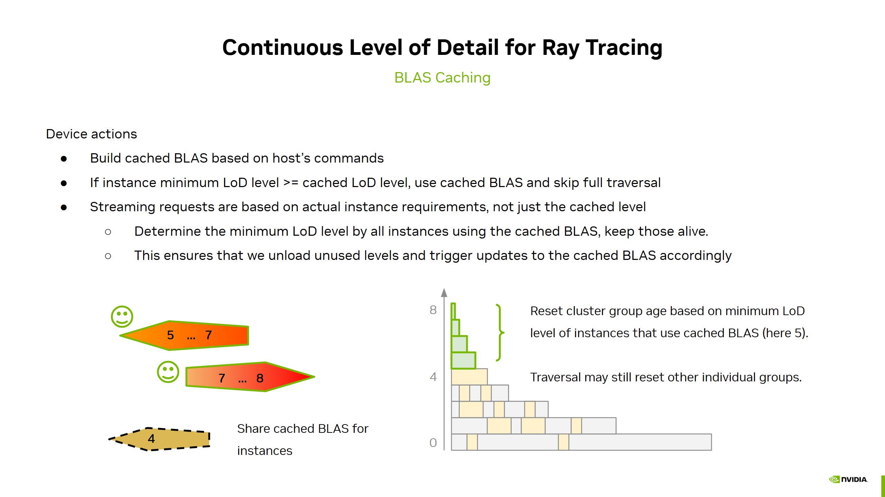

# BLAS Caching for ray tracing cluster-based continous level of detail

This technique builds upon and enhances ["BLAS Sharing"](blas_sharing.md) (Bottom Level Acceleration Structure).

**BLAS Sharing** enabled the re-use of BLAS within a frame across instances that use the same geometry.
With **Blas Caching** a BLAS is re-used over multiple frames and can therefore be useful for geometry that isn't instanced much.

## Algorithm

When BLAS sharing it can be observed that the sharing level of detail (LoD) of a particular geometry might not change over multiple
frames. Another observation was that higher LoDs (with less detail) were more likely to be fully resident. This is also due ray tracing
not culling within an object.

A single fully loaded LoD level can be used in a rotational invariant way for all instances whose minimum LoD level is equal or greater to
a discrete LoD level. Therfore the cached BLAS is based on a single discrete LoD level.

A lot of the cached BLAS logic can be implemented on the host, as the host already handles the streaming requests. The
streaming system can detect which LoD levels have been loaded completely and see if an update to the cached BLAS is necessary.

We typically enable the caching for a certain number of tail LoD levels, as this gives better predictable on maximum geometric complexity of the BLAS. An object with 16 LoD levels is somewhat likely to contain roughly similar amount of geometry in its last 8 LoD levels than an object with 10 levels. If we were counting from the font, say starting at the fourth LoD level, the object with more LoD levels would yield a much more detailed cached BLAS.

Another positive effect of using the host to drive BLAS builds, is that we can also use it to sub-allocate the persistent BLAS memory
space. We can use the pre-build information of a cluster BLAS to get a fairly accurate memory estimate for the BLAS. While for CLAS this estimate is typically inaccurate, as it depends on the triangle topology, for cluster BLAS it's very good, only depending on the number of clusters.

The streaming system uses the exsiting scene level patching to provide information about cached BLAS updates and builds.

On the device we do some BLAS build prepartion, gatherhing the CLAS (Cluster Level Acceleration Structure) addresses used for the cached BLAS.
Furthermore we determine if an instance's minimum LoD level is equal or greater than the cached level and can therefore use the cached BLAS instead of the per-frame BLAS.

Since BLAS caching skips instance traversal, which resets the age of groups for streaming, we need to manage the age reset elsewhere. During age filtering, all streaming groups are iterated through. We check if they are part of a cached BLAS and ensure their LoD (Level of Detail) level remains active by resetting their age. The LoD level is determined by the minimum LoD level of any instance using the cached BLAS, not the cached level itself. Otherwise, unloading would never be triggered.

## Implementation

In the source look for `USE_BLAS_CACHING` and `useBlasCaching`.

Note:
* The sample kept "shared" instances independent of "cached".
  However, one might simplify the system and only classify instances in "merged" or "cached", rather than the the multiple states of
  "merged", "shared", "cached", "prebuilt low detail".
* The sample did not build cached BLAS directly into the persisten storage, but copies them from the per-frame implicit BLAS location.
  We could build directly into the persistent memory space, but it's a bit easier in the current system to just plug into the per-frame 
  builds using implicit building mode.

Key changes in the shaders and device code are:
* [`stream_update_scene.comp/glsl`](../shaders/stream_update_scene.comp.glsl): If required, patches the latest cached BLAS address and lod level for a geometry.
* [`streaming.glsl`](../shaders/streaming.glsl): `streamingAgeFilter(... useBlasCaching)`: The age filtering during streaming must prevent unloading of cached levels that are still required.
* [`geometry_blas_sharing.comp.glsl`](../shaders/geometry_blas_sharing.comp.glsl) The geometry evaluation is changed to account for cached blas. This can avoid using merged / shared instances and fully rely on the cached blas.
* [`traversal_init_blas_sharing.comp.glsl`](../shaders/traversal_init_blas_sharing.comp.glsl) Modify the instance's decision which BLAS to use. We use `BLAS_BUILD_INDEX_CACHE_BIT` to tag cached BLAS.
* [`blas_caching_setup_build.comp.glsl`](../shaders/blas_caching_setup_build.comp.glsl): Feeds the CLAS addresses into the cached BLAS list of references prior building.
* [`blas_caching_setup_copy.comp.glsl`](../shaders/blas_caching_setup_copy.comp.glsl): Sets up the BLAS copy from the per-frame BLAS builds into their persistent storage. 
* [`instance_assign_blas.comp.glsl`](../shaders/instance_assign_blas.comp.glsl): When assigning the BLAS to the ray tracing instance, account for cached BLAS use-case.
* [`scene_streaming.cpp`](../src/scene_streaming.cpp): Check the `SceneStreaming::handleBlasCaching` function.

