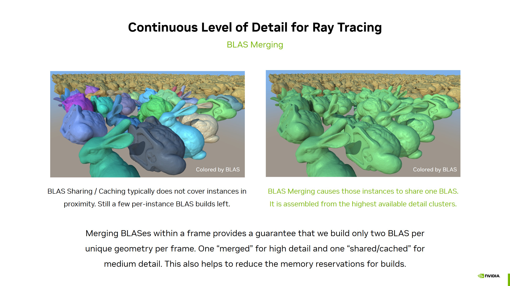
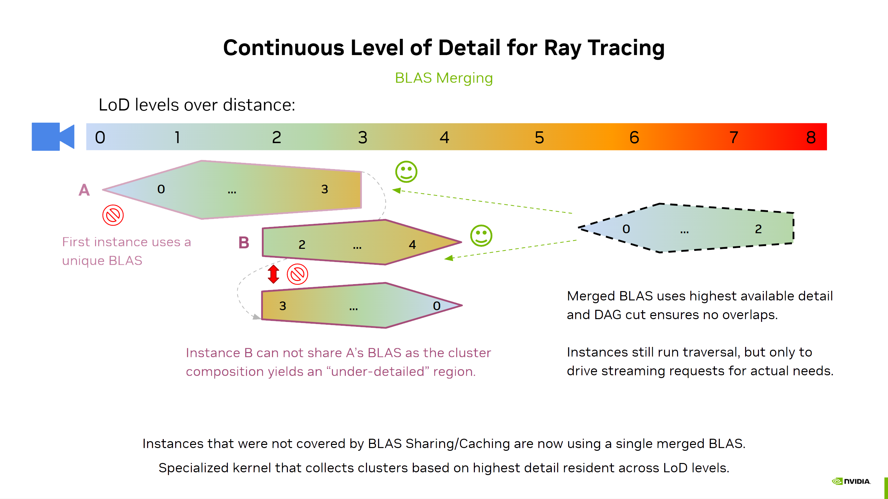
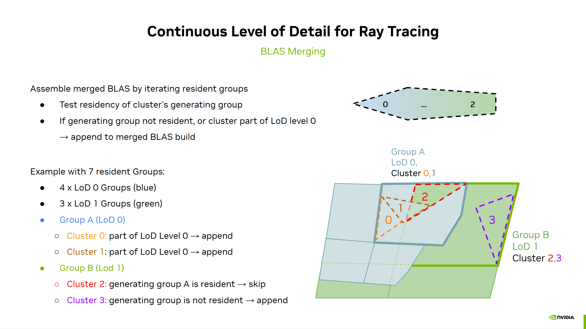
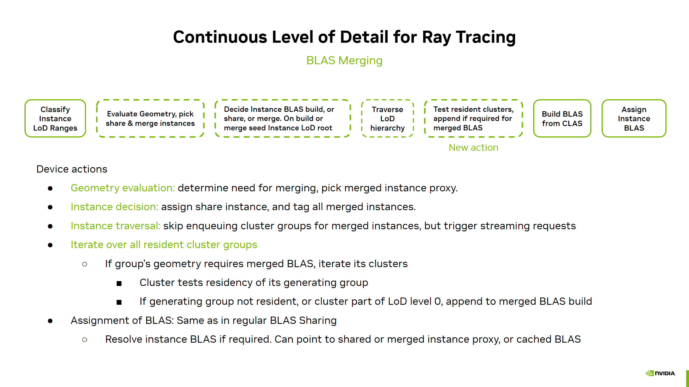

# BLAS Merging for ray tracing cluster-based continous level of detail

This technique builds upon and enhances ["BLAS Sharing"](blas_sharing.md).

In **BLAS Sharing** instances were categorized as follows:
* pre-built low-detail BLAS
* shared BLAS: typically configured for medium detail onwards, we recycle one other instance's BLAS. See ["BLAS Caching"](blas_caching.md) to use a cached BLAS in this scenario.
* per-instance BLAS: typically the high detail instances of a given geometry. A **"merged"** BLAS is now used for all these instances instead.

Because there is only one "merged BLAS" and potentially one "shared" or "cached" BLAS, the merging technique provides us with an upper limit of two or three BLAS builds per frame per unique geometry.

**BLAS Merging** creates a single BLAS, for all the "per-instance BLAS" instances that would have used their own BLAS before. 
This "merged" BLAS is based on the highest available detail that is resident, and is therefore by design compatible with any instance.

However, the streaming system must still be informed about the actual detail requests of those instances and so traversal cannot be skipped completely. The traversal is faster as it skips iterating the clusters within a cluster group for these instances.

To build the merged BLAS we use a specialized kernel that iterates over all resident cluster groups. We do such an iteration already
for the age-based filtering of groups to trigger unloads. Within the iteration we now test if a cluster group is part of a geometry
that needs a merged BLAS (due to cached BLAS we might skip the merged BLAS completely) and then iterates the clusters within.

If a cluster is of LoD level zero, it is appended to the merged BLAS. If the cluster's generating group (the group that had higher 
detail) isn't resident, it means it's also appended. Ohterwise it is not and we assume another group's clusters is responsible for this 
region of the model.

Similar to BLAS sharing, we use one instance as proxy and it is building the merged BLAS. The other instances refer to its final BLAS address when they assign it to their ray tracing instances.

## Implementation

In the source look for `USE_BLAS_MERGING` and `useBlasMerging`.

* [`geometry_blas_sharing.comp.glsl`](../shaders/geometry_blas_sharing.comp.glsl) The geometry evaluation is electing one instance as proxy for building the merged BLAS.
* [`traversal_init_blas_sharing.comp.glsl`](../shaders/traversal_init_blas_sharing.comp.glsl) Modify the instance's decision which BLAS to use. It leverages the existing `BLAS_BUILD_INDEX_SHARE_BIT` to implement the indirection to the proxy instance that builds the merged BLAS.
* [`traversal_blas_merging.comp.glsl`](../shaders/traversal_blas_merging.comp.glsl) This kernel does the combined age filtering and filling the BLAS references list with the highest detail clusters for all merged geometries at once.
* [`traversal_run.comp.glsl`](../shaders/traversal_run.comp.glsl) For instances that use merging (`INSTANCE_USES_MERGED_BIT`) we can skip traversing the cluster groups in detail, however, streaming requests must still be performed for groups that should be streamed in.