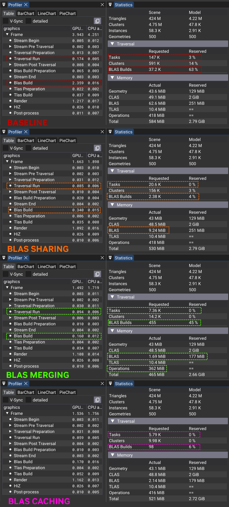

# BLAS Sharing for ray tracing cluster-based continous level of detail


BLAS sharing enables the re-use of a BLAS from a higher detailed instance
for other instance's that can safely use it. It allows to reduce the number of BLAS builds
in a continous level of detail (LoD) technique. As ray tracing is less susceptible
to performance issues from meshes with high triangle density, it is an option
that a rasterizer would not take.


In the above illustration we give a brief example how certain instances can re-use the
BLAS of others depending on their relative positioning towards the camera.

## Solution

To avoid per-instance LoD decisions (traversal), BLAS memory and build overhead, lower detail instances share the BLAS of higher detail instances. Compatibility of such sharing must be ensured, so that an instance doesn't become "under-detailed".
This is done by first classifying instances by their LoD level range, for which conservative estimates for their minimum and maximum LoD levels are computed.


## LoD Traversal

When rendering with continous LoD techniques,
view-dependent versions of a geometry are created with the intent
to have more detail towards the camera viewpoint.


In this cluster LoD based system this is achieved by the following rules:
* The cluster's group evaluates the LoD metric above a certain error threshold
* The cluster group that the cluster was generated from is below the threshold.
  This generating group is from a LoD level below (higher detail) and was
  simplified into a region of the geometry that the cluster belongs to.

Note that the group error does not reflect the current cluster error. The rules
above effectively cause clusters to be renderer that are "fine enough" to be below 
the error threshold.

As a result, continous LoD techniques show less transition effects
(LoD popping). Furthermore, rasterization performance benefits from avoiding high 
degrees of sub-pixel triangles.

The downside is that typically one may not be able to share one version of
such a geometry for another instance using the same geometry, as
each instance may traverse the cluster groups across different LoD levels
slightly differently.

For ray tracing this can mean we might build many BLAS per frame, even when we are
instancing the same geometry many times.

## Instance LoD Range Classification

The key to BLAS sharing is identifying the conservative LoD range of each instance.


**Minimum LoD level**

For the minimum LoD the maximum error of a LoD level and the instance's sphere
are used to evaluate the error metric at the closest point towards the camera.
It is guaranteed that successive LoD levels would have an equal or higher error value.

The first LoD level that yields a positive evaluation of the metric is the
lowest possible LoD level according to the rules mentioned before.

**Maximum LoD level**

For the maximum LoD we place a sphere at the camera opposing end of the instance's sphere,
but still within. Its radius is based on the smallest cluster group within the LoD level
and its error value is bases on the smallest error found. This gives us the theoretical
worst case cluster group for this particular LoD level. Similar as before the properties
of this sphere is monotonically increasing over the LoD levels. Meaning later LoD levels
have higher errors and/or higher radius.

Just like with the maximum, we pick the first LoD level where the metric evaluates
with a positive result. Because our rules pick clusters where the first transition
between above and below threshold happens, it cannot be that this transition happens
at a later LoD level, cause they are guaranteed to be coarser (higher error or bigger radius).

**Adjustments**

The current implementation implements some fudging of the LoD ranges to allow
sharing at lower detail, compared to what is actually required. This can be enabled
beginning from certain LoD level onwards for any instance.
Furthermore lower detail requirements can be enabled for instances that do not
have primary visibility (outside frustum or occluded) as reflections and or
indirect shadows may be acceptable with less detail.

**Geometry Histogram Update**

For each unique geometry in a scene a histogram is filled to track
how many instances start or end their LoD range at each corresponding LoD level.

Furthermore through an atomic maximum operation we try to find the "furthest" instance
that ends at a certain LoD level.

``` glsl
  // pack LoD min in upper 5 most significant bits, and instanceID in lower 27
  // this should give us a "stable" result on a static camera
  uint packedLodInstance = (lodLevelMin << 27) | instanceID & 0x7FFFFFF;
  atomicMax(build.geometryHistograms.d[geometryID].lodLevelMaxPackedInstance[lodLevelMax], packedLodInstance);
```

## Geometry Histogram Evaluation

After the previous step each geometry histogram is evaluated.
In this operation the histogram over all LoD levels is iterated from highest to lowest detail and
the maximum LoD level of the sharing instance is determined. Once the lod level was determined
the instance itself is found using the previously mentioned packed value.

``` glsl
  // find the instance that will share its blas based on `lodLevelMax`
  uint packedLodInstance = build.geometryHistograms.d[geometryID].lodLevelMaxPackedInstance[lodLevelMax]`;
```

As result each geometry now stores a reference to the sharing instance and the 
maximum LoD level from which onward its BLAS can be used in a rotational invariant way.

For now we use a basic heuristic for this with some basic knobs to pick one instance.
More sophisticated strategies and sharing multiple instances for different LoD ranges
are to be investigated.

## Instance Sharing and Traversal Preparation

Not every instance can share another's instance BLAS.
Each instance is tested against four categories in the following order:
1. Its minimum LoD level matches the geometry's maximum level.
    - It uses the pre-built low detail BLAS.
    - Neither LoD traversal nor BLAS building is necessary.
2. It is the instance that provides the BLAS for sharing according to the geometry's histogram evaluation before.
    - LoD traversal and BLAS build are required.
3. Its minimum LoD level is equal or greater than the geometry's shared maximum LoD level, therefore it can share another BLAS despite different orientation in space.
    - It uses the sharing instance's BLAS.
    - Neither LoD traversal nor BLAS building is necessary.
5. It is used in a view-dependent manner.
    - LoD traversal and BLAS build are required.

## Implementation

> [!IMPORTANT]
> Please familiarize yourself with the "Runtime Rendering Operations" section in
> the primary [readme](../README.md).


In the source look for `USE_BLAS_SHARING`.

The following kernels contain key aspects of the implementation in the provided order:
* [shaders/instance_classify_lod.comp.glsl](../shaders/instance_classify_lod.comp.glsl): Runs the instance LoD classification and feeds the geometry LoD level histograms. Updates corresponding `shaderio::GeometryBuildHistogram` and `shaderio::InstanceBuildInfo`. Set each TLAS instance to use the low detail BLAS, this may be overwritten at a later time.
* [shaders/geometry_blas_sharing.comp.glsl](../shaders/geometry_blas_sharing.comp.glsl): Evaluates the geometry histogram to pick a good candidate instance and updates `shaderio::GeometryBuildInfo`.
* [shaders/traversal_init_blas_sharing.comp.glsl](../shaders/traversal_init_blas_sharing.comp.glsl): Reads the instance LoD classification from `shaderio::InstanceBuildInfo` and the corresponding `shaderio::GeometryBuildInfo` to test which category an instance belongs to.
* [shaders/instance_assign_blas.comp.glsl](../shaders/instance_assign_blas.comp.glsl): Is run after the BLAS were built and assigns the TLAS instance BLAS. The BLAS assigned here was built in this frame and can come either from the instance itself (category 2 or 4 above) or through an indirection (category 3). For category 1 no assignment is required, as it was already handled at beginning. It could also happen that we ran out of cluster render list space, and hence no BLAS was actually built, in which case also no assignment is done.

## Example Results

In this [sample scene](https://grabcad.com/library/lego-ideas-tree-house-21318-1) there is a lot of LEGO® bricks instancing that allows great BLAS re-use.


Looking at the various statistics we can see that the overall frame time is greatly reduced from `5.9` to `1.6` milliseconds due to the very high reduction of BLAS builds. This also lowers the BLAS memory from `120 MB` to `7 MB`. Last but not least the required traversal tasks as well as render list usage is reduced by a factor of ten or more.

While in this particular scene the render time is also a little bit less, because of the improved cache hits on a smaller set of BLASes, other scenes can see an increase in trace time. A small increase is more commonly expected, as the shared BLAS will cause objects afar to use more detail than necessary. This can be mitigated by introducing more than just one shared BLAS for different LoD levels.



> LEGO® is a trademark of the LEGO Group of companies which does not sponsor, authorize or endorse this site