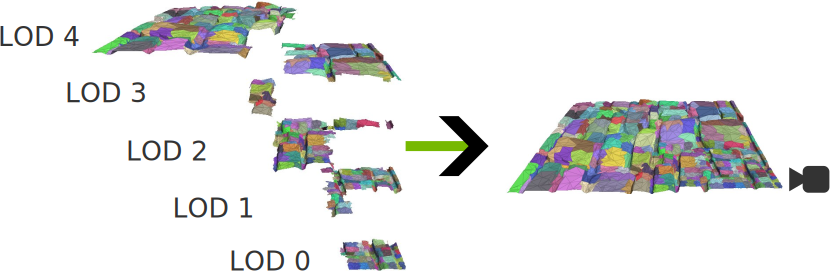
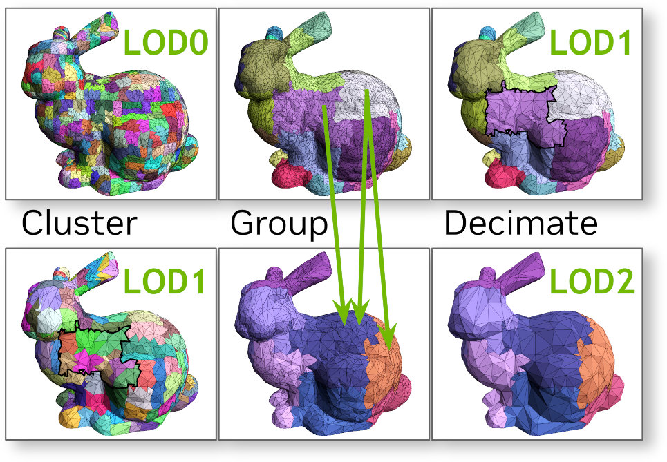
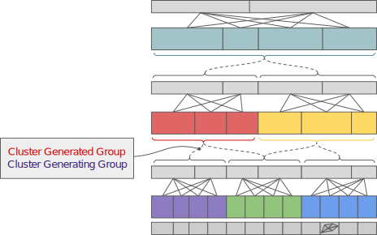
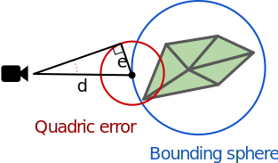
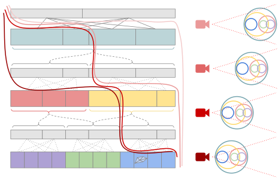
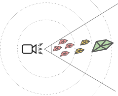
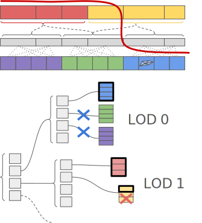

# Continuous Cluster LoD Generation

This sample showcases a _continuous_ level of detail (LOD) system for triangle meshes.
Continuous LOD allows for fine-grained control over geometric detail within a
mesh, compared to traditional discrete LOD. Clusters of triangles are carefully
precomputed by decimating the original mesh in a way that they can be seamlessly
combined across different LOD levels. At rendering time, a subset of these
clusters is selected to adaptively provide the required amount of detail as the
camera navigates the scene.

## How it works

The key to continuous LOD is a decimation strategy that allows regular
watertight LOD transitions across a mesh. Such transitions require borders that
match on both sides, and are obtained by keeping the border of the triangle
edges fixed during decimation. Since these edges do not change, successive
iterations of decimation must choose different borders and fix new edges to let
the old ones decimate.

To explain why, consider forming groups of triangles and decimating triangles
within. Then grouping the decimated groups and decimating again *recursively*
until there is just one root group. In this case, some of the vertices would
remain fixed across the entire hierarchy, and would be decimated only when the
last two groups are grouped and decimated to form the coarsest LOD. To avoid
this, new groups must instead be allowed to cross any border, and in fact
encouraged to.

This procedure makes groups of geometry and decimates within *groups*. Decimated
geometry is then re-grouped, encouraging crossing the old group's borders when
forming new groups. Groups are made from clusters of triangle rather than just
triangles for performance reasons. A group is a cluster of clusters of
triangles. Whole triangle clusters are swapped in and out at runtime for detail
transitions.

### Building LODs

The image above shows the process that is repeated to create LODs until there is
just a single cluster representing the whole mesh:

1. Make clusters [, within old borders]

   We either use `meshopt_buildMeshletsSpatial` or `meshopt_buildMeshletsFlex` for the
   clusterization. See `clusterize` function inside [meshopt_clusterlod.h](../src/meshopt_clusterlod.h).

2. Group clusters [, crossing old borders]

   This is just making clusters of clusters, but with a catch. Border edges
   cannot decimate so it is important to encourage grouping clusters in a way to
   keep old borders internal to the group. Then the previously locked edges are
   free to decimate. 

   See `partition` function inside [meshopt_clusterlod.h](../src/meshopt_clusterlod.h).

   If there is only one cluster in one group, the entire building operation is complete.

3. Decimate within groups, keep border

   Vertices shared between groups are computed and locked before using
   [meshoptimizer](https://github.com/zeux/meshoptimizer)'s `simplify` to
   decimate each cluster group. The aim is to halve the number of triangles.
   These become the input to the next iteration.

   See `simplify` function inside [meshopt_clusterlod.h](../src/meshopt_clusterlod.h).

The entire loop can be seen at `while (context.pending.size() > 1)` within the `clodBuild`
function inside [meshopt_clusterlod.h](../src/meshopt_clusterlod.h).

When decimating, the generating group is tracked. This is the geometry each
cluster was decimated from. A cluster's group is one of many groups generated by
decimating its generating group. Similarly a group has many generating groups.
Clusters will be selected in intersections of groups and generating groups -
perhaps something to optimize the decision making with. The term *parent* is
avoided due to possible confusion between the originating geometry and the
direction to the root node.

The image above shows an example 2D illustration with colored groups, their
clusterings and relationships. Notably, two groups of clusters may produce
decimated clusters that are both part of a new group. This allows group borders
to be decimated after each iteration. The relationships form a directed acyclic
graph (DAG), i.e. not a tree, with the constraint that relationships don't skip
levels - but maybe that could help with uneven detail? LOD transitions may only
happen across group borders, which places a limit on the rate of LOD change.

The output data are:

- Clusters of triangles, referencing vertices in the original mesh
- Groupings of clusters and their relationships:
  - Generating geometry, input to decimation
  - Generated geometry, decimation output
- Group bounding spheres
- Group decimation quadric error

### Selecting Clusters

The first step is to pick the goal. A couple of examples are:

1. Pixel-sized triangles?
2. Sub-pixel-sized geometric error?

The latter may be more efficient if for example large triangles give the same
visual result. This may be more challenging to quantify particularly if
decimation introduces error not captured by the metric. We use the [*quadric
error*](https://www.cs.cmu.edu/~./garland/Papers/quadrics.pdf), an approximate
measure of the object-space distance between the decimated mesh and the original
high-resolution mesh.

A conservative maximum vertex position error is maintained for all cluster
groups. This is the farthest any vertex may be from representing the original
surface. When rendering we ask, "what is the largest possible angular error from
the camera?" for a particular group. We then want to render geometry when its
error is just less than a threshold, but not any overlapping geometry.

The farthest a decimated vertex may be incorrectly representing geometry is the
quadric error. This will be bigger in screen space nearer the camera so the
nearest point on the group's bounding sphere is chosen. The largest possible
angular error from the camera is then the angular size of a sphere with quadric
error radius at that point. Convenient and simple: the arcsine of the error
divided by the distance to the closest point on the bounding sphere. A target
threshold can be chosen based on a single pixel's FOV at the center of the
projection - to keep any geometric error less than the size of a pixel. This
avoids varying the threshold across the image, which would further complicate a
problem yet to solve.

We have a target goal and a way to compute it, but how can we guarantee a single
unique continuous surface? I.e. no holes and no overlaps. An ideal solution
would be to pick clusters that satisfy the angular error threshold but constrain
the rest to only making a single LOD transition per group. That would require
traversing the graph with its adjacency information, visualized above. The term
is a making graph cut and it would be challenging to do quickly and in parallel
on a GPU.

We ideally want to test whether to render a cluster independently. We could
render geometry where its error is the first below the threshold, i.e. its
decimated error is greater. Just that would actually guarantee no holes, but
there would still be overlaps. E.g. two clusters that represent the same surface
being drawn at once. This can happen when the bounding sphere of a decimated
group is so far from the camera that its conservative angular error is smaller
than a group's angular error that it was decimated from.

The solution implemented here is to artificially increase the size of
the bounding spheres such that the nearest point to the camera is always nearer
than that on a bounding sphere of its generating geometry. In short, make
bounding spheres bound generating geometry too. Once done, a single watertight
mesh can be stitched together from independent parallel decisions. In general,
the angular error, or whatever metric is compared to a threshold, must never
decrease with each level of decimation. The failure above was a decrease due to
the size distortion of a perspective projection.

One derivation glossed over so far is why store bounding spheres and errors per
group. The simple answer is that for LOD transitions to work, the entire group
must change LOD at the same time, so all clusters in a group must share the same
values.

### Spatial Hierarchy

This sample computes a spatial hierarchy of bounding spheres to search for
cluster groups of the right LOD in the right spatial region relative to the
camera. The `Scene::buildGeometryLodHierarchy` function is responsible
for this operation and is found inside [scene_cluster_lod.cpp](../src/scene_cluster_lod.cpp).

One way to think of this is there are many high-detailed clusters and few low
detail. If an object is far away, only the low-detailed clusters should be
checked. That is, the search can exit early if it is known that all remaining
clusters are too detailed.

Another way of thinking about this is at a certain distance range from the
camera, as shown in the image above, only clusters with certain bounding sphere
radii and quadric error ranges should be rendered. Thus, the search space can be
reduced by conservatively searching only that region. An r-tree could work well
here too.

The hierarchy is actually a set of hierarchies - one for each LOD level. For
convenience, per-level roots are merged since the application would need to
search all levels anyway, or at least their roots.

Leaf nodes point to cluster groups and are initialized with the group's
decimated cluster maximum quadric error (i.e. from the next level\*) and the
group's bounding sphere. The hierarchy is built by recursively spatially
clustering nodes - not fast, but it works and it isn't a bottleneck yet.
Internal nodes are given the maximum quadric error and bounding sphere of their
children.

\*The group quadric error is the error of the generated group's clusters, i.e.
after decimation, not the error in the group's clusters. This avoids
unnecessarily storing a per-cluster error.

The tree can be traversed using the same angular error check as for cluster
groups, exiting when the node's error is less than the threshold. The trees for
LODs with too fine detail will exit early. The blue crosses in the above image
show an example - those nodes are already below the threshold. Since traversed
leaf nodes have already been checked to be above the threshold, and they are
initialized with cluster's generated group's error, their clusters only need to
check that they are below the threshold in order to select them for rendering.
Note that the entire group may not necessarily be drawn. For example, two of the
yellow clusters were not below the threshold (red cross). This same check is
made by the blue group's leaf node and blue clusters are drawn instead.

While it is possible to exit early from a tree with too coarse detail, it may
interfere with streaming, depending on how dependencies are implemented.

This traversal is implemented inside [traversal_run.comp.glsl](../shaders/traversal_run.comp.glsl).

> This text is a slightly modified version from the deprecated `nv_cluster_lod_library` [documentation](https://github.com/nvpro-samples/nv_cluster_lod_builder/blob/main/README.md#how-it-works).