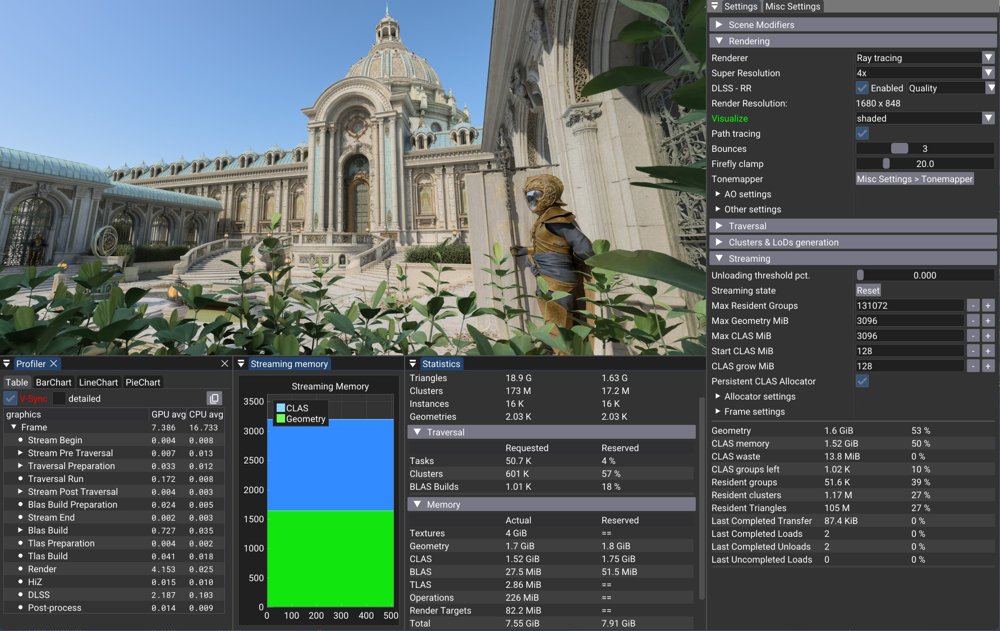
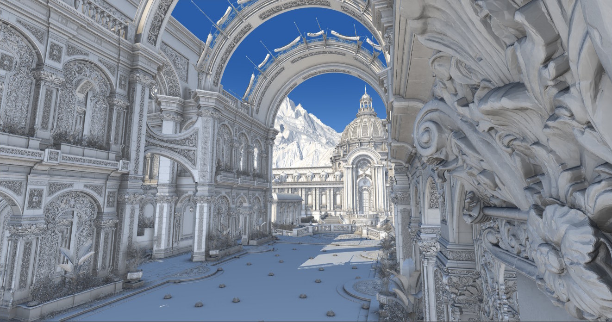
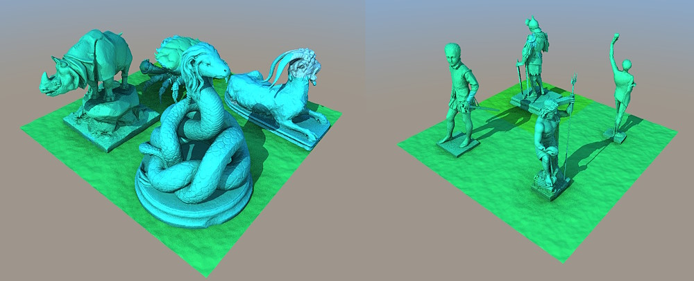

# Additional Scenes

## Zorah Demo Scene

This is a glTF export of the highly detailed raw geometry from the [NVIDIA RTX Kit - Zorah Sample](https://developer.nvidia.com/rtx-kit?sortBy=developer_learning_library) as [presented at GDC 2025](https://developer.nvidia.com/blog/nvidia-rtx-advances-with-neural-rendering-and-digital-human-technologies-at-gdc-2025/).

Store these files on an SSD (ideally NVMe). A large render cache file is required next to them.

We provide two versions:
- with textures (`zorah_textured_public` ~ 130 GB on disk with render cache)
- geometry-only (`zorah_main_public` ~ 35 GB on disk with render cache)

You only need to download one of them.

> [!IMPORTANT]
> Open or Drag & Drop the `zorah_textured_public.v1.cfg` file within the vk_lod_clusters application and _NOT_ the `.gltf` directly.
> Opening the glTF directly causes additional visual artifacts.
>
> Some settings may be overridden through the local project's `scene_overrides/zorah_textured_public.v1.cfg` file.

- [zorah_textured_public.v1.7z](https://developer.download.nvidia.com/ProGraphics/nvpro-samples/zorah_textured_public.v1.7z)
  - We recommend GPUs with at least 12 GB VRAM. 
  - Textures default to a ~4 GiB budget, but the source supports much higher detail - raise it with `--maxtexturemegabytes <MB>`. (Texture streaming is planned.)
  - Vertex Attributes: Positions, normals, tangents and texcoords.
  - 1.63 G Triangles, with instancing 18.9 G Triangles
  - 4418 Textures
  - Cannot be pre-loaded must be streamed
  - ** 70 GB 7z** - 2026/8/25, unpacks to **78 GB on disk**
  - The render cache file will require **50 GB on disk** next to the gltf file, it will be generated on first opening of the scene.
  - If you want to process it separately in the background use the following command-line:
    - `vk_lod_clusters.exe "zorah_textured_public.v1.cfg" --processingonly 1 --processingthreadpct 0.5 --processingpartial 1 --processingmemorygigabytes -60`
    - This will use 50% of the local PC's supported concurrency and around 60% of its RAM to process the model and allow to abort and resume the processing. On a 16-core Ryzen 9 a value of `0.5` will yield 16 threads, and takes around 5-7 minutes.
  - For more advanced shading use this asset with the [RTXMG SDK](https://github.com/NVIDIA-RTX/RTXMG) which includes a lod system ported from this codebase.

> [!IMPORTANT]
> Open or Drag & Drop the `zorah_main_public.v2.cfg` or `zorah_main_public.v2.no_mountains.cfg` file within the vk_lod_clusters application and _NOT_ the `.gltf` directly. Opening the glTF directly causes additional visual artifacts.

- [zorah_main_public.v2.gltf.7z](https://developer.download.nvidia.com/ProGraphics/nvpro-samples/zorah_main_public.v2.gltf.7z)
  - We recommend GPUs with at least 8 GB VRAM
  - Vertex Attributes: Positions and normals.
  - 1.63 G Triangles, with instancing 18.9 G Triangles
  - Cannot be pre-loaded must be streamed
  - **7.22 GB 7z** - 2026/3/10, unpacks to **9.32 GB on disk**
  - The render cache file will require **26 GB on disk** next to the gltf file, it will be generated on first opening of the scene.
  - If you want to process it separately in the background use the following command-line:
    - `vk_lod_clusters.exe "zorah_main_public.v2.gltf" --processingonly 1 --processingthreadpct 0.5 --processingpartial 1 --processingmemorygigabytes -60`
    - This will use 50% of the local PC's supported concurrency and around 60% of its RAM to process the model and allow to abort and resume the processing. On a 16-core Ryzen 9 a value of `0.5` will yield 16 threads.
  - **NOTE:** Older versions of this file were larger, this sample has changed the file format of its file cache. When loading an old version, the processing will be triggered automatically and the old cache file is overwritten. It can take a bit until the new file versions have been propagated to servers worldwide.

Known Issues:
* Compared to the original demo some of the vegetation had to be removed to make the sharing of the glTF possible (the asset itself is licensed under MIT License).
* Some objects float a bit strangely in the air and lack animation, this is expected for this scene and sample.
* The vegetation will appear to fade out a bit quickly, especially the grass. This is a known limitation for mesh-based simplifcation on
  sparse geometry like this. We do not use any techniques that preserve volume during decimation.
* Trees can appear a bit blurry with DLSS and very noisy without it. We will try to improve future versions of DLSS denoising this scenario.
* The ray tracing performance does suffer from the background mountains overlapping with the primary buildings. Use `zorah_main_public.v2.no_mountains.cfg`.

## Threedscans Statues

These scenes are based on models from [https://threedscans.com/](https://threedscans.com/):
- [threedscans_animals](https://developer.download.nvidia.com/ProGraphics/nvpro-samples/threedscans_animals.zip)
  - 7.9 M Triangles
  - ~ 1.4 GB preloaded memory
  - 128 MB zip 2025/7/11 (original was 290 MB zip, slow to load)
- [threedscans_statues](https://developer.download.nvidia.com/ProGraphics/nvpro-samples/threedscans_statues.zip)
  - 6.9 M Triangles
  - ~ 1.3 GB preloaded memory
  - 116 MB zip 2025/7/11 (original was 280 MB zip, slow to load)

On a "AMD Ryzen 9 7950X 16-Core Processor" processing time for `threedscans_animals` took around 10 seconds (5 unique geometries). That scene has few geometries and many triangles per geometry. Processing is parallelized over the unique geometries, so such a scene keeps only a few threads busy. Scenes with many objects spread over far more threads and tend to be processed faster overall.
By default the application now stores a cache file of the last processing (`--autosavecache 1`).
